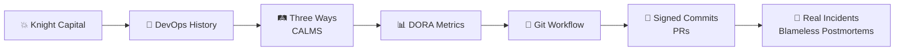
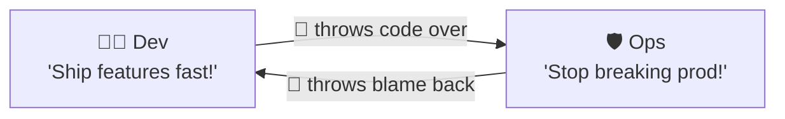
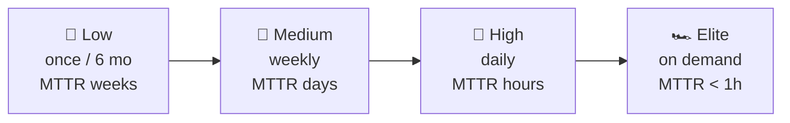
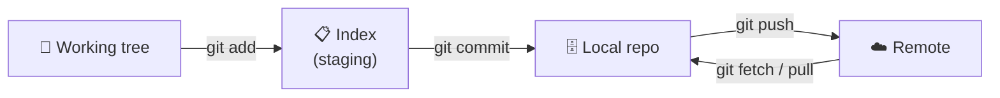
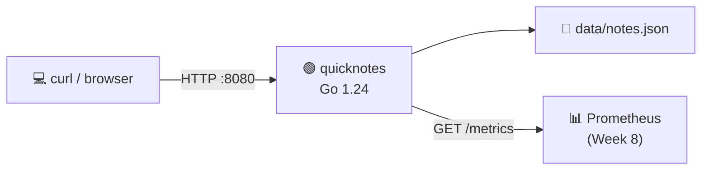
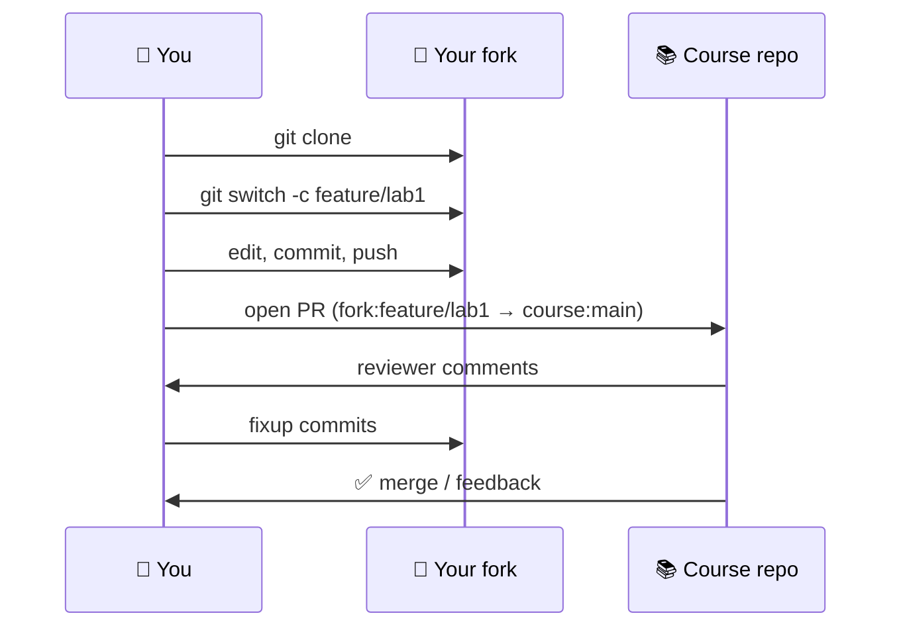
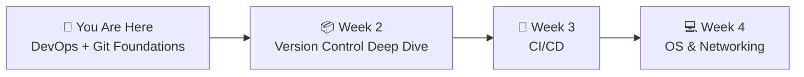

# 📌 Lecture 1 — Introduction to DevOps: From Conflict to Collaboration

---

## 📍 Slide 1 – 💥 When a 45-Minute Deploy Killed a Bank

* 🗓️ **August 1, 2012, 9:30 a.m. ET** — Knight Capital, the largest US equities trader, pushes a new release of its order-routing software (SMARS) to 8 production servers
* 🚨 One server was missed during the manual deploy — it kept running **old, dead code** that re-activated a long-disused flag called **Power Peg**
* 💸 In the first **45 minutes** of market open, the rogue server submitted **4 million erroneous orders**, accumulating a **$440 million loss**
* 🏦 Knight had to be rescued, then acquired by Getco by December 2012 — gone as an independent firm
* 🎓 **Lesson:** A single bad deploy can sink a 1,000-person company. *How* you ship is now as important as *what* you ship

> 🤔 **Think:** Knight had top-tier traders and top-tier code. What they didn't have was DevOps — automated deploys, kill switches, rollback. Could the same incident hit you tomorrow?

---

## 📍 Slide 2 – 🎯 Learning Outcomes

By the end of this lecture you will:

| # | 🎓 Outcome |
|---|-----------|
| 1 | ✅ Explain what DevOps is, who coined the term, and the problem it solves |
| 2 | ✅ Describe the Three Ways and the CALMS framework |
| 3 | ✅ Cite the four DORA metrics and what elite vs low performance looks like |
| 4 | ✅ Use Git's mental model: working tree → index → repository |
| 5 | ✅ Set up signed commits and a PR template to make collaboration safer |
| 6 | ✅ Recognize that GitHub and GitLab are both valid paths for the rest of this course |

---

## 📍 Slide 3 – 🗺️ Lecture Overview



* 📍 Slides 1-4 — Why DevOps exists at all
* 📍 Slides 5-9 — History, frameworks, and how to measure DevOps
* 📍 Slides 10-13 — Git from first principles
* 📍 Slides 14-18 — Your course project, fork→PR, signed commits, templates
* 📍 Slides 19-22 — Real incidents, culture, and what Lab 1 asks of you

---

## 📍 Slide 4 – 🧱 The Wall of Confusion

Before DevOps had a name, software shops looked like this:



* 🏢 **Dev** got rewarded for new features → pushed code as fast as possible
* 🛡️ **Ops** got rewarded for uptime → resisted every release
* 💥 The incentives **directly conflicted**, so every deploy was a fight
* 🎢 Releases happened **once a quarter**, at 2 a.m., under a freeze, with rollback plans written in Word docs

> 💬 *"It's like a relay race where the runners hate each other."* — paraphrasing John Allspaw, ca. 2009

---

## 📍 Slide 5 – 📜 The Birth of DevOps (2008–2009)

* 🇨🇦 **August 2008, Toronto** — at Agile Conference, **Andrew Shafer** proposes a session called *"Agile Infrastructure"*. Almost no one shows up — except **Patrick Debois**
* 🇧🇪 **October 30–31, 2009, Ghent** — Debois organizes the first **DevOpsDays**, named so it would fit a Twitter hashtag
* 🐦 The conversation explodes on `#devops` and never stops
* 📺 Earlier that year (June 2009 at Velocity), **John Allspaw and Paul Hammond** of Flickr give the legendary talk **"10+ Deploys per Day: Dev and Ops Cooperation"** — proof the model works
* 📚 **2013** — Gene Kim's novel *The Phoenix Project* makes DevOps mainstream literature

> 💬 *"DevOps was a movement before it was a term."* — Patrick Debois

---

## 📍 Slide 6 – 🛤️ The Three Ways (Gene Kim)

From *The Phoenix Project* (2013) and *The DevOps Handbook* (2016):

| # | Way | Mental model | What it asks of you |
|---|----|--------------|---------------------|
| 1 | 🛤️ **Flow** | Left-to-right: idea → code → prod | Optimize the whole stream, not the local task |
| 2 | 🔁 **Feedback** | Right-to-left: prod telling Dev what happened | Shorter loops, more signals, no blame |
| 3 | 🧪 **Continual Learning** | Experiment + amplify what worked | Blameless postmortems; deliberate practice |

> 🤔 **Think:** Which "Way" was Knight Capital missing the most?

---

## 📍 Slide 7 – 🔤 The CALMS Framework

| Letter | What it means | Concrete signal |
|--------|---------------|-----------------|
| **C** | **Culture** | Devs and Ops sit together; nobody says "throw it over the wall" |
| **A** | **Automation** | A deploy is a `git push`, not a 14-step runbook |
| **L** | **Lean** | Small batch sizes; finish a thing before starting the next |
| **M** | **Measurement** | You can name your deploy frequency and MTTR off the top of your head |
| **S** | **Sharing** | Postmortems, blogs, internal demos — knowledge is not hoarded |

*Coined as CAMS by John Willis & Damon Edwards in 2010; **L** for Lean added later by Jez Humble.*

> 💬 *"If you can't measure it, you can't improve it."* — Peter Drucker, often invoked by the M

---

## 📍 Slide 8 – 📊 DORA: The Four Key Metrics

The **DevOps Research and Assessment** group (DORA, founded ~2014, acquired by Google 2018) studied tens of thousands of teams. Four metrics predict performance:

| Metric | What it captures | Elite teams |
|--------|------------------|-------------|
| 🚀 **Deployment frequency** | How often you ship to prod | Multiple times per day |
| ⏱️ **Lead time for changes** | Commit → in production | < 1 hour |
| 🔁 **Change failure rate** | % of deploys that need a fix | 0–15% |
| 🛠️ **MTTR** | Mean time to recover from an incident | < 1 hour |

From 2021, a fifth metric — **Reliability** — was added to track operational stability.

> 📖 **Read:** *Accelerate* by Forsgren, Humble & Kim (2018) — the scientific paper-form of these findings

---

## 📍 Slide 9 – 🥇 Elite vs Low Performers



* 🐌 Low performers and Elite performers differ by **~200×** on deployment frequency
* 🔁 Elite teams also have **lower** change failure rates — speed and safety go together
* ❌ "Move fast and break things" is **not** the elite pattern. Elite is **move fast and don't break things, because feedback loops are tight**

> 🤔 **Think:** Which bucket does the project you'll graduate to next year sit in? Which would you want it in?

---

## 📍 Slide 10 – 🌳 Why Git? Why Now?

DevOps needs a **single source of truth** for code, infra, and process. Git is that truth:

* 📦 The Git repository is **all of history** plus the current state — every laptop has a full copy
* 🤝 Pull requests turn "review my code" into a **collaboration protocol**, not a favor
* 🔁 Branches let you experiment without breaking the trunk
* 🤖 CI/CD systems (next week) **react to Git events** — a push triggers a pipeline, a tag triggers a release

> 💬 *"Git is the assembly language of collaboration."* — folklore, attributed to many

---

## 📍 Slide 11 – 📜 Where Git Came From

* 🐧 **April 2005** — Linus Torvalds writes Git in roughly **10 days** after the Linux kernel loses access to BitKeeper
* 🎯 Design goals: speed, distributed model, integrity (cryptographic hashes), strong support for non-linear development
* 😏 On the name: *"I'm an egotistical bastard, and I name all my projects after myself. First Linux, now Git."* — Linus
* 🪪 In **November 2021** (Git **2.34**), Git gained native **SSH commit signing** — no GPG keyring required
* 🆕 By April 2026 we're on **Git 2.49+** — `git switch`, `git restore`, `git maintenance` are the modern ergonomics

> 📖 **Book:** *Pro Git* (Scott Chacon & Ben Straub) — free at [git-scm.com/book](https://git-scm.com/book)

---

## 📍 Slide 12 – 🧠 Git's Mental Model



| Stage | What it is | Common command |
|-------|------------|----------------|
| 📂 Working tree | Files on disk you can edit | `git status` |
| 📋 Index | "What I plan to commit" | `git add -p` |
| 🗄️ Local repo | Permanent history on *your* machine | `git commit -s -S` |
| ☁️ Remote | Shared truth (GitHub / GitLab) | `git push origin feature/x` |

> 🤔 **Think:** Why does Git separate "Index" from "Working tree"? *(Hint: ever made a typo *just* before committing?)*

---

## 📍 Slide 13 – 🌿 Branching Strategies in 90 Seconds

| Strategy | Branch lifetime | Where it shines |
|----------|-----------------|-----------------|
| 🌲 **Trunk-based** | Hours | Continuous delivery, large teams, feature flags |
| 🌳 **GitHub Flow** | Days | SaaS apps, this course |
| 🌴 **GitFlow** | Weeks-Months | Versioned products with long support windows |

* ✅ This course uses **GitHub Flow** — short-lived `feature/labN` branches, one PR per lab
* ❌ Avoid: a `develop` branch nobody merges, six-month feature branches that never come home, "let's just push to main on Friday afternoon"

> 💬 *"The longer your branch lives, the more it hurts to merge."* — every senior engineer eventually

---

## 📍 Slide 14 – 🧪 Your Course Project: QuickNotes

Across **all 10 labs** you'll work on one small Go service: **QuickNotes**.



* 🟢 **Endpoints:** `GET /notes`, `GET /notes/{id}`, `POST /notes`, `DELETE /notes/{id}`, `GET /health`, `GET /metrics`
* 🛠️ You don't write the app — you **package it, ship it, observe it, and harden it**
* 📈 By Lab 10, the same code will live behind your own CI, in a container, on a cluster, behind monitoring and security scans, deployed to a real cloud

> 🤔 **Think:** Why one project for 10 weeks? Because that's how DevOps actually feels at work.

---

## 📍 Slide 15 – 🍴 The Fork → Branch → PR Workflow



* 1️⃣ **Fork** the course repo on GitHub *or* GitLab
* 2️⃣ **Clone** your fork locally
* 3️⃣ **Branch** per lab: `feature/lab1`, `feature/lab2`, …
* 4️⃣ **Commit** small, signed, and with a message that reads like a sentence
* 5️⃣ **Push** to *your* fork, never directly to the course repo
* 6️⃣ **Open** a PR back to the course repo's `main`

---

## 📍 Slide 16 – 🔐 Signed Commits & the Supply Chain

* 🕵️ Anyone can put **any name and email** in `git config` — your commit history is unauthenticated by default
* 💥 Real consequences: in **March 2024**, an attacker (account `JiaT75`) maintained the **xz-utils** project for two years and slipped in a backdoor that nearly compromised every SSH daemon on Linux
* 🪪 A signed commit is a cryptographic claim: *"this commit really was made by the holder of this key"*
* ✅ Git supports **SSH signing** since **2.34** (Nov 2021) — no GPG keyring, just reuse your SSH key

```sh
# ✅ enable SSH signing (one-time)
git config --global gpg.format ssh
git config --global user.signingkey ~/.ssh/id_ed25519.pub
git config --global commit.gpgsign true
```

> 🤔 **Think:** Would you merge a PR from a contributor whose commits showed "Unverified" on GitHub?

---

## 📍 Slide 17 – 📜 Pull Request Templates

A PR template lives at `.github/pull_request_template.md` (GitHub) or `.gitlab/merge_request_templates/Default.md` (GitLab) and **auto-fills the PR description**.

```markdown
## Goal
What does this PR accomplish?

## Changes
- bullet
- bullet

## Testing
How did you verify it?

## Checklist
- [ ] Title is a clear sentence
- [ ] Commits are signed
- [ ] Docs / submission file updated
```

* ✅ Templates make reviews **predictable** — the same sections every time
* ✅ They surface **what you tested** before reviewers have to ask
* ❌ Keep them **short**. Long templates get deleted by the author

---

## 📍 Slide 18 – 🦊 GitHub or GitLab? Both Are Fine

| Feature | GitHub | GitLab |
|---------|--------|--------|
| Hosting | github.com | gitlab.com or self-hosted CE |
| Branch protection | ✅ | ✅ |
| Code review | Pull Request | Merge Request |
| CI | GitHub Actions | GitLab CI/CD |
| SSH commit signing | ✅ (verified badge) | ✅ (verified badge) |
| Free private repos | ✅ | ✅ |

* 🚫 **Some students lose access to GitHub** for reasons outside their control — sanctions, account locks, country-of-origin filters
* ✅ Every lab in this course offers a **GitLab path**. Lab 3 explicitly mirrors the CI pipeline to `.gitlab-ci.yml` as a Bonus Task
* 🏛️ Innopolis itself runs an internal GitLab at `gitlab.pg.innopolis.university` — that's your safety net

> 🤔 **Think:** The *concepts* — branches, PRs, CI — are platform-independent. The tool is replaceable; the discipline isn't.

---

## 📍 Slide 19 – 🔥 When DevOps Wasn't There: Real Incidents

| 🗓️ Date | 🏢 Who | 💥 What broke | 🎓 What it teaches |
|--------|--------|---------------|---------------------|
| 2012-08-01 | Knight Capital | Stale code on 1 of 8 servers → $440M in 45 min | **Automate deploys; never trust manual checklists** |
| 2017-01-31 | GitLab.com | Engineer `rm -rf`-ed primary DB; 5 of 5 backups broken | **Test your restores, not just your backups** |
| 2017-02-28 | AWS S3 us-east-1 | Typo in a maintenance command removed too many capacity nodes | **Blast-radius limits; canaries; reversible commands** |
| 2024-07-19 | CrowdStrike | Faulty kernel-mode update → 8.5M Windows hosts in BSOD loop | **Staged rollouts; reversible deploys; vendor risk** |
| 2024-03 | xz-utils backdoor | 2-year social-engineering attack on a single maintainer | **Code provenance; signed commits; SBOMs (Lab 9)** |

> 📝 **Read:** [GitLab database incident postmortem (2017)](https://about.gitlab.com/blog/2017/02/01/gitlab-dot-com-database-incident/) — frank, painful, and instructive

---

## 📍 Slide 20 – 🪶 Blameless Postmortems

A postmortem is a written record of **what happened, why, and what changes**. Done well, it's the most valuable artifact of an outage.

| 🔥 Blameful | ✅ Blameless |
|-------------|-------------|
| "Alice pushed bad code" | "The deploy pipeline allowed an untested change to reach prod" |
| "Bob didn't read the runbook" | "The runbook was 41 pages long and last updated in 2019" |
| Punishment, hidden incidents | Learning, surfaced incidents, future-proof fixes |

* 🧪 The goal is to make the **system** safer, not to find a person to blame
* 📚 Norms set by John Allspaw at Etsy (~2012) and codified in the **Google SRE Workbook**, Chapter 9
* ✅ Every serious lab in this course ends with a `submissions/labN.md` — your mini-postmortem of how the lab went

> 💬 *"You will never make a system safer by punishing the humans inside it."* — Sidney Dekker, *The Field Guide to Understanding Human Error*

---

## 📍 Slide 21 – 🧠 Key Takeaways

1. 💡 **DevOps is a culture** that puts Dev and Ops on the same team with the same goals — not a job title
2. 🛤️ **Three Ways:** Flow, Feedback, Continual Learning
3. 📊 **DORA's four metrics** make DevOps measurable: deploy frequency, lead time, change failure rate, MTTR
4. 🌳 **Git is the spine** of every DevOps workflow — fork, branch, PR, sign your commits
5. 🤝 **GitHub or GitLab — pick what works for you.** Both are first-class in this course
6. 🪶 **Blame systems, not people** — the postmortem you write after a bad day is the most valuable thing you'll produce that week

> 💬 *"It works on my machine" is no longer an acceptable answer.*

---

## 📍 Slide 22 – 🚀 What's Next + 📚 Resources

* 📍 **Next lecture:** Version Control deep dive — Git's object model, reset/reflog, tagging, modern commands
* 🧪 **Lab 1:** Fork the QuickNotes repo, configure SSH commit signing, add a PR template, open your first PR (GitHub *or* GitLab), engage with one open-source project as community proof
* 📖 **Read this week:**
  * 📕 *The Phoenix Project* — Kim, Behr & Spafford (2013) — Chapters 1-3
  * 📗 *The DevOps Handbook* — Kim, Humble, Debois & Willis (2nd ed 2021) — Part I
  * 📘 *Pro Git* — Chacon & Straub — Chapters 1-2 ([free](https://git-scm.com/book))
* 🎥 **Watch:** [Allspaw & Hammond — "10+ Deploys per Day" (2009)](https://www.youtube.com/watch?v=LdOe18KhtT4)
* 📝 [Knight Capital SEC filing on the 2012 incident](https://www.sec.gov/litigation/admin/2013/34-70694.pdf)
* 📝 [Patrick Debois on the term "DevOps"](https://devopsdays.org/about) — DevOpsDays origin



> 🎯 **Remember:** Every lab in this course is a small experiment in shipping software safely. The tools change every five years. The discipline doesn't.
