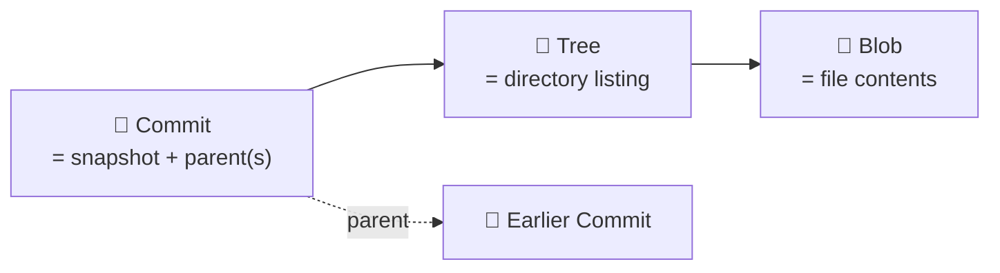
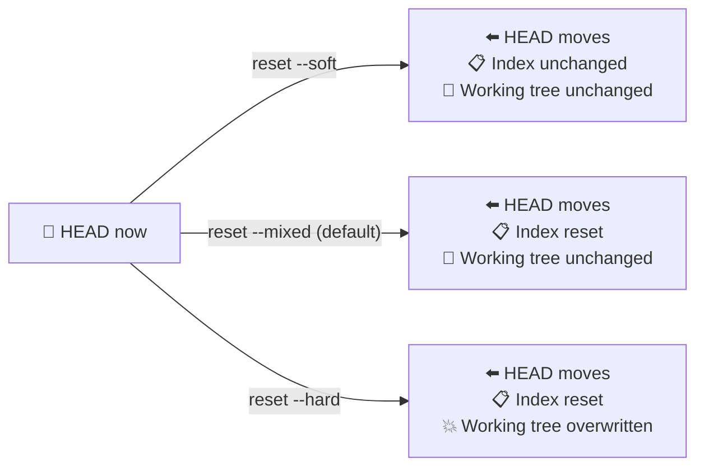
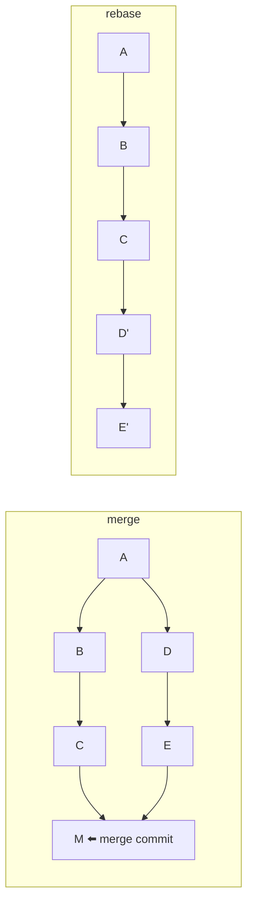
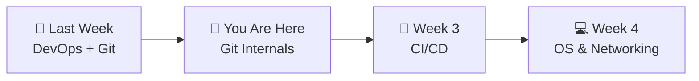

# 📌 Lecture 2 — Version Control Deep Dive: Git Internals & Recovery

---

## 📍 Slide 1 – 💥 The `--hard` That Cost a Demo

* 🗓️ **Friday, 4:48 p.m.** — engineer realizes a feature branch has the wrong starting commit
* 🪓 Runs `git reset --hard origin/main` to "clean it up" — without committing the four hours of unstaged work
* 💀 `git status` is suddenly empty. So is the working tree. So is `git log`
* 🪦 Demo on Monday. No backups
* 🔦 At 4:55 p.m. a senior engineer types `git reflog`. **Everything is still there.** Five minutes of recovery vs five hours of rewriting

> 🤔 **Think:** Git almost never actually deletes anything. Knowing *where it hides things* is the difference between panic and a 5-minute recovery.

---

## 📍 Slide 2 – 🎯 Learning Outcomes

By the end of this lecture you will:

| # | 🎓 Outcome |
|---|-----------|
| 1 | ✅ Explain Git's three object types: blob, tree, commit |
| 2 | ✅ Read what a ref is, and what HEAD really points at |
| 3 | ✅ Recover from a "lost commit" using the reflog |
| 4 | ✅ Use `reset --soft / --mixed / --hard` deliberately |
| 5 | ✅ Choose between `merge`, `rebase`, and `bisect` for the job at hand |
| 6 | ✅ Use modern Git ergonomics: `switch`, `restore`, `worktree`, `maintenance` |

---

## 📍 Slide 3 – 🗺️ Lecture Overview


* 📍 Slides 1-4 — Inside `.git/`
* 📍 Slides 5-9 — Refs, reflog, and three flavors of reset
* 📍 Slides 10-14 — Merge, rebase, bisect, worktree
* 📍 Slides 15-18 — Tags, stash, hooks, modern commands
* 📍 Slides 19-22 — Antipatterns, real incidents, what's next

---

## 📍 Slide 4 – 📦 What's Inside `.git/`?

```text
.git/
├── HEAD                # current branch ref
├── config              # local repo config
├── objects/            # blobs, trees, commits — the whole history
│   ├── 4b/             # subdirs by first 2 chars of SHA
│   │   └── 825dc642cb6eb9a060e54bf8d69288fbee4904
│   ├── info/
│   └── pack/           # packed objects after `git gc`
├── refs/
│   ├── heads/main      # → SHA of latest commit
│   ├── tags/
│   └── remotes/origin/
└── logs/               # the reflog lives here
```

* 🗄️ The `.git/` directory **is** your repository. Delete it and the project is just a folder
* 🔍 Every commit, blob, branch, and tag is reachable from this tree
* 🧪 Try in your QuickNotes fork: `find .git/objects/ -type f | head` — those are your blobs and commits

---

## 📍 Slide 5 – 🧱 Three Object Types



| Type | Holds | Real example |
|------|-------|--------------|
| 🟢 **Blob** | A file's bytes (no name, no metadata) | `app/main.go` content |
| 🌳 **Tree** | Names + modes + SHAs of blobs (and sub-trees) | The `app/` directory listing |
| 📝 **Commit** | Tree SHA + parent(s) + author + message | "feat(app): add /metrics" |

* 🔑 Every object is identified by the **SHA-1** of its contents (Git is moving to **SHA-256**; new repos can opt in via `git init --object-format=sha256`)
* 🔁 Identical content → identical SHA → **deduplication for free**

> 💡 *Same `index.html` in two branches? One blob, two trees referencing it.*

---

## 📍 Slide 6 – 🔍 Cat-File: Seeing the Plumbing

```bash
# ✅ what's in HEAD?
$ git cat-file -t HEAD
commit

$ git cat-file -p HEAD
tree   a1b2c3...
parent 4d5e6f...
author Dmitrii Creed <...> 1716728400 +0300
committer ...
feat(app): introduce QuickNotes

# ✅ peek into the tree
$ git cat-file -p a1b2c3
100644 blob d4e5f6...  README.md
040000 tree 7a8b9c...  app
```

* 🧪 `cat-file -t <sha>` prints the type; `-p` pretty-prints
* 🧰 These are the **plumbing** commands — what the **porcelain** (add, commit, log) calls underneath
* 🔬 The `Pro Git` book, chapter 10, walks the whole object model — required reading this week

---

## 📍 Slide 7 – 🏷️ Refs: Where the Names Live

A **ref** is a human-readable name pointing at a commit SHA. That's it.

| Ref | What it points at | Where it lives |
|-----|-------------------|----------------|
| `HEAD` | The current commit (usually via a branch) | `.git/HEAD` |
| `refs/heads/main` | Tip of `main` | `.git/refs/heads/main` |
| `refs/tags/v1.0.0` | A frozen commit | `.git/refs/tags/v1.0.0` |
| `refs/remotes/origin/main` | Last known tip of remote `main` | Updated by `git fetch` |

```bash
$ cat .git/HEAD
ref: refs/heads/feature/lab2
$ cat .git/refs/heads/feature/lab2
4b825dc642cb6eb9a060e54bf8d69288fbee4904
```

* 🎯 A "detached HEAD" simply means `HEAD` stores a SHA directly, not a branch ref

---

## 📍 Slide 8 – 🪤 The Reflog: Git's Time Machine

The reflog is a per-ref **history of where it has been**. Default retention: **90 days** for reachable commits, **30 days** for unreachable.

```bash
$ git reflog
b8fc480 HEAD@{0}: commit: feat(app): introduce QuickNotes
6f044dd HEAD@{1}: checkout: moving from main to s26-refactor
6f044dd HEAD@{2}: pull: Fast-forward
0a87e1c HEAD@{3}: commit: refactor: reduce prescriptiveness
```

* 🆘 If your branch tip "disappears" — `git reflog`, find the SHA, `git reset --hard <sha>` or `git branch rescue <sha>`
* 🧪 Even after `reset --hard`, the discarded commits are unreachable but **still in `.git/objects/`** until `git gc` runs

> 💬 *"Reflog is the most reassuring thing I learned in my first year with Git."* — every senior engineer

---

## 📍 Slide 9 – ⏪ Three Flavors of Reset



| Mode | Touches HEAD | Touches Index | Touches Working tree | When to use |
|------|--------------|---------------|----------------------|-------------|
| `--soft` | ✅ | ❌ | ❌ | Re-arrange last few commits, keep changes staged |
| `--mixed` | ✅ | ✅ | ❌ | "Un-add" files; keep edits in working tree |
| `--hard` | ✅ | ✅ | ✅ | Burn down to a clean state — **dangerous** |

> ⚠️ **Only `--hard` is destructive to uncommitted work.** Always check `git status` before running it.

---

## 📍 Slide 10 – 🆕 `switch` and `restore` — Modern Ergonomics

Git 2.23 (Aug 2019) split the overloaded `git checkout` into two clearer commands:

| Old (still works) | New | What it does |
|-------------------|-----|--------------|
| `git checkout main` | `git switch main` | Change branch |
| `git checkout -b feat/x` | `git switch -c feat/x` | Create + switch |
| `git checkout main app/main.go` | `git restore --source=main app/main.go` | Restore a file to a version |
| `git checkout -- app/main.go` | `git restore app/main.go` | Discard working-tree changes |

* ✅ Prefer `switch` / `restore` in new tutorials — intent is explicit
* ❌ Avoid `git checkout` for file restore; the same command for "change branch" and "destroy my edits" is a footgun

---

## 📍 Slide 11 – 💾 `git stash` — The Suspense Account

```bash
# ✅ save current uncommitted work
$ git stash push -m "wip on /metrics"

# ✅ list stashes
$ git stash list
stash@{0}: On feature/lab2: wip on /metrics

# ✅ pop the most recent back (apply + delete)
$ git stash pop
```

* 🪤 Stash is **not** a substitute for a branch — entries don't survive `git gc` once they fall out of the reflog (≤ 30 days unreachable)
* 💡 Use `git stash --keep-index` to stash unstaged changes while keeping staged ones
* 🚨 Common bug: stash on branch A, switch to B, pop → conflicts. **Pop on the same branch you stashed on**

---

## 📍 Slide 12 – 🏷️ Tags: Lightweight vs Annotated

```bash
# ❌ lightweight — just a ref, no metadata
git tag v1.0.0

# ✅ annotated — tagged object with message, author, signature
git tag -a -s v1.0.0 -m "First production release"

# 📤 push tags (they don't go with regular push)
git push origin v1.0.0
```

| Lightweight | Annotated |
|-------------|-----------|
| Just `refs/tags/X → SHA` | Full Git object with message |
| Cannot be signed | **Can be GPG/SSH signed** |
| Useful as private bookmarks | Use for **all** public releases |

> 💡 Releases in CI/CD (next lecture) trigger on annotated, signed tags — that's how you prove the artifact really came from this codebase.

---

## 📍 Slide 13 – 🔀 Merge vs Rebase: Two Truths About History



| | `git merge` | `git rebase` |
|---|------------|--------------|
| Resulting history | Preserves branch topology | Linear, easier to read |
| Creates new commits? | One merge commit | Rewrites every commit on the rebased branch |
| Safe on shared branches? | ✅ | ❌ — never rebase pushed commits others depend on |
| Conflicts resolved | Once | Once per commit on the rebased branch |

* 🧪 **Rule of thumb in this course:** rebase your `feature/labN` onto `main` before opening the PR; merge the PR itself
* ⚠️ Never rebase `main` itself — that's a public branch

---

## 📍 Slide 14 – 🐛 `git bisect`: Binary Search for the Bug

QuickNotes returned a 500 yesterday but worked last week. Where did it break?

```bash
$ git bisect start
$ git bisect bad HEAD                       # current is broken
$ git bisect good v1.0.0                    # this tag was fine
# Git checks out a commit ~midway
$ go test ./...                             # or any reproducer
$ git bisect good   # or `bad`
# Git narrows further...
$ git bisect reset                          # when found
```

* 🎯 With *N* commits between good and bad, you find the culprit in **log₂(N)** steps
* 🤖 Want it automatic? `git bisect run go test ./...` — Git iterates until the test starts failing
* 🪤 Real-world story: the **Linux kernel** team uses bisect to find regressions across tens of thousands of commits, multiple times a week

---

## 📍 Slide 15 – 🌲 `git worktree`: Multiple Branches, Same Repo, No Stashing

```bash
# ✅ keep main checked out in ., add an extra checkout for a hotfix
$ git worktree add ../quicknotes-hotfix hotfix/auth
$ cd ../quicknotes-hotfix
# do hotfix work...
$ cd -
# main checkout untouched the whole time
$ git worktree list
/home/you/quicknotes        b8fc480 [feature/lab2]
/home/you/quicknotes-hotfix  a1b2c3d [hotfix/auth]
```

* 🆕 Available since Git 2.5 (Jul 2015), polished by 2.30+
* ⚡ Faster than stashing + switching for "I need to look at another branch right now"
* 🧹 Clean up with `git worktree remove ../quicknotes-hotfix`

> 💡 We'll use worktrees in Lab 7 to keep the Ansible playbook and the app side-by-side without juggling stashes.

---

## 📍 Slide 16 – 🩺 `git maintenance`: Keep the Repo Fast

```bash
# ✅ schedule weekly maintenance (cron / launchd / systemd)
git maintenance start

# ✅ run it manually
git maintenance run --task=gc --task=loose-objects --task=incremental-repack
```

* 🧹 Compacts loose objects, prunes the reflog, refreshes `commit-graph` for fast `log`/`merge`/`bisect`
* 📉 On a multi-GB repo (Linux kernel, Chromium), this is the difference between `git log` taking **2s** vs **45s**
* 🆕 Available since Git 2.29 (Oct 2020); enabled by default in many distros from 2.42+

---

## 📍 Slide 17 – 🪝 Pre-commit Hooks: Catch It Before You Push

`.git/hooks/` is local to the repo. The **pre-commit** framework manages shareable hooks across the team:

```yaml
# ✅ .pre-commit-config.yaml
repos:
  - repo: https://github.com/pre-commit/pre-commit-hooks
    rev: v5.0.0
    hooks:
      - id: trailing-whitespace
      - id: check-merge-conflict
      - id: no-commit-to-branch
        args: [--branch, main]
```

* 🛡️ Block bad commits **at your laptop** before CI burns minutes finding them
* 🧪 In Lab 3, your CI will run `gofmt`/`go vet`/`go test` — pre-commit lets the same checks run before push
* ❌ Avoid running heavy test suites in pre-commit — engineers will disable hooks they find slow

---

## 📍 Slide 18 – 🧹 Common Antipatterns

| 🔥 Antipattern | ✅ Better |
|----------------|-----------|
| `git push --force` to a shared branch | `git push --force-with-lease` (refuses if remote moved) |
| `git reset --hard` without checking `git status` first | `git stash push` then `reset`; reflog will save you anyway |
| `git pull` (which is `fetch` + `merge`) on a feature branch | `git fetch && git rebase origin/main` for linear history |
| Committing secrets ("I'll remove it next push") | Add to `.gitignore` *first*; if leaked, **rotate**, then BFG-clean |
| 50-line commit messages with no subject | Subject ≤ 50 chars, blank line, body explains *why* |
| Squash-merging a 200-commit PR | Split into smaller PRs; squash hides bisect points |

---

## 📍 Slide 19 – 📜 Real Story: AWS Keys in Git History

* 🗓️ **2015** — A developer commits AWS access keys to a public repo
* 🤖 Within **minutes**, bots scrape GitHub for credentials and spin up cryptominers on their account
* 💸 The student's $0 AWS account ends up with a **$2,300 bill** by morning
* 🛠️ Fixing leaked secrets means **rewriting history** with [BFG Repo-Cleaner](https://rtyley.github.io/bfg-repo-cleaner/) or `git filter-repo` — *and* rotating the credential, because once it's pushed, assume it's harvested
* 🪦 Lesson: `.gitignore` your `.env`, never commit `*.pem`, and run a secret scanner in CI (we will, Lab 9)

> 🤔 **Think:** Why is "just delete the commit" not enough?

*(Because everyone who cloned still has it. And bots cache it. And GitHub's API still serves the diff.)*

---

## 📍 Slide 20 – 🧠 Key Takeaways

1. 🧱 **Three objects, one truth:** blobs are bytes, trees are listings, commits are snapshots
2. 🏷️ A **ref** is just a name on a SHA — `HEAD`, branches, tags, all the same idea
3. 🪤 **The reflog saves your job** — Git almost never throws anything away
4. ⏪ **`--soft / --mixed / --hard` are different tools** — pick deliberately
5. 🔀 **Rebase your feature branch onto main, merge the PR** — the best of both worlds
6. 🛠️ **Modern commands** (`switch`, `restore`, `worktree`, `maintenance`) are not optional in 2026

> 💬 *"Git is hard. Print this lecture and put it on the wall."* — every junior engineer eventually

---

## 📍 Slide 21 – 🚀 What's Next + 📚 Resources

* 📍 **Next lecture:** CI/CD — turning every push into a test, build, and (eventually) deploy
* 🧪 **Lab 2:** Explore Git's object model on the QuickNotes repo, force a `reset --hard`, recover via reflog, tag a release, rebase a feature branch
* 📖 **Read this week:**
  * 📕 *Pro Git* — Chacon & Straub — **Chapters 7 & 10** (the plumbing)
  * 📗 [Git Magic — Ben Lynn](https://www-cs-students.stanford.edu/~blynn/gitmagic/) — short, free, focused on day-2 problems
  * 📘 [Git from the Bottom Up — John Wiegley](https://jwiegley.github.io/git-from-the-bottom-up/) — for understanding objects deeply
* 🛠️ **Tools to try:**
  * 🔍 `tig` — a curses interface over `git log` (`apt install tig`)
  * 🎨 `git log --oneline --graph --all --decorate` — the only graph you need
  * 🧰 [git-absorb](https://github.com/tummychow/git-absorb) — auto-creates fixup commits



> 🎯 **Remember:** You don't need to memorize every Git command. You need to know **what's in `.git/`**, **what HEAD points at**, and **how to find the reflog when something explodes**.
