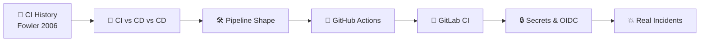
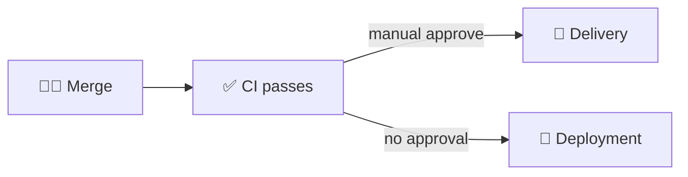
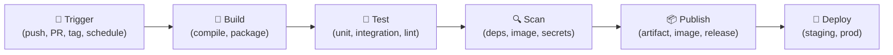
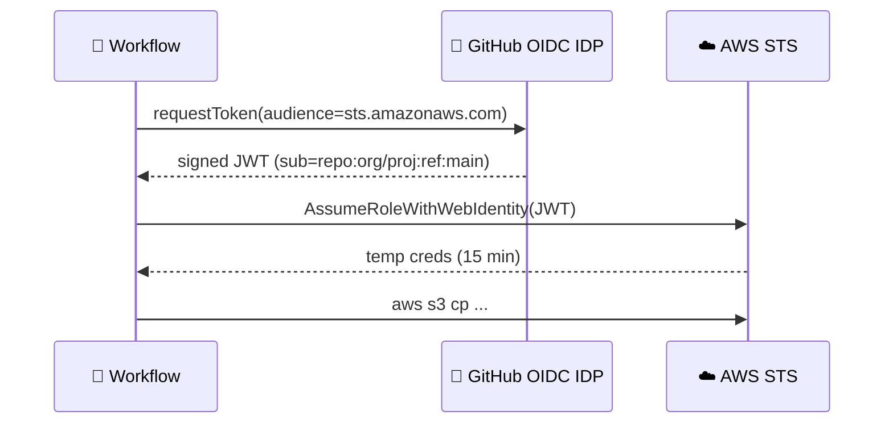
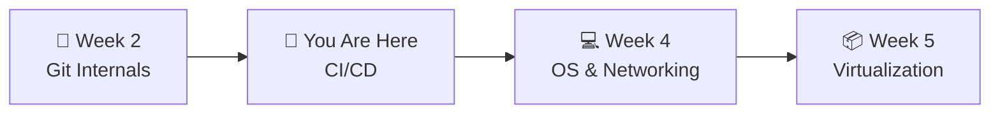

# 📌 Lecture 3 — CI/CD: From `it works on my machine` to `it works on every machine`

---

## 📍 Slide 1 – 💥 The Commit That Got Caught

* 🗓️ **Friday, 11:47 a.m.** — a developer pushes a "small refactor" to QuickNotes
* 🤖 90 seconds later, the **CI pipeline** flags a unit test failure plus a `go vet` warning
* 📩 PR is auto-blocked. The developer fixes both before lunch
* 🪦 **Alternative timeline:** no CI. The bug ships on Monday. Customer reports `/notes` returning empty arrays on Wednesday. Postmortem on Friday
* 🎓 **Lesson:** CI doesn't make engineers smarter. It makes the consequence of being wrong **fast and cheap**

> 🤔 **Think:** The same human, the same commit. One world catches it in 90 seconds. The other catches it in 7 days. What changed?

---

## 📍 Slide 2 – 🎯 Learning Outcomes

| # | 🎓 Outcome |
|---|-----------|
| 1 | ✅ Distinguish Continuous Integration, Delivery, and Deployment |
| 2 | ✅ Describe a four-stage pipeline: trigger → build → test → publish |
| 3 | ✅ Write a GitHub Actions workflow for a Go project |
| 4 | ✅ Write the equivalent GitLab CI pipeline |
| 5 | ✅ Use caching, matrix builds, and reusable workflows safely |
| 6 | ✅ Identify common CI supply-chain risks (tj-actions, secret leaks) |

---

## 📍 Slide 3 – 🗺️ Lecture Overview



* 📍 Slides 1-5 — History and what CI/CD actually means
* 📍 Slides 6-11 — GitHub Actions in detail
* 📍 Slides 12-15 — GitLab CI in detail, and a comparison
* 📍 Slides 16-19 — Caching, matrices, secrets, OIDC
* 📍 Slides 20-22 — Real incidents and what Lab 3 asks of you

---

## 📍 Slide 4 – 📜 The Origin of CI

* 🏗️ **1991** — Grady Booch coins **"Continuous Integration"** in *Object-Oriented Design with Applications*
* 🟢 **2000** — Kent Beck makes it a practice of **Extreme Programming**: integrate at least daily, automated tests
* 📝 **2006** — Martin Fowler publishes the canonical [*Continuous Integration*](https://martinfowler.com/articles/continuousIntegration.html) article — still the best 20-minute read on the topic
* 📚 **2010** — Jez Humble & Dave Farley publish *Continuous Delivery* (winner, Jolt Award)
* 🤖 **2011-2018** — Travis CI, CircleCI, Jenkins X, then **GitHub Actions** (Nov 2019, GA Feb 2020) and modern **GitLab CI/CD** (2012, integrated since)

> 💬 *"If it hurts, do it more often, and bring the pain forward."* — Jez Humble

---

## 📍 Slide 5 – 🎯 CI vs CD vs CD

| Acronym | What it means | Trigger | Risk per change |
|---------|---------------|---------|-----------------|
| **CI** — Continuous Integration | Merge changes to mainline frequently; auto-build + test on each merge | `git push` | Low — only build |
| **CD** — Continuous **Delivery** | Every CI-passing build is **deployable** (manual click to ship) | Same — human approval | Medium — gated |
| **CD** — Continuous **Deployment** | Every CI-passing build is **automatically shipped** | Same — no human | High — full automation |



* 🎯 This course practices **CI + Delivery**. Continuous *Deployment* shows up in SRE-Intro
* 🪪 The word *"CD"* is overloaded — always clarify Delivery or Deployment

---

## 📍 Slide 6 – 🛠️ The Shape of Every Pipeline



* 🔔 **Trigger** — what starts it (a `git push`, a PR, a tag, a cron, a manual click)
* 🔨 **Build** — produce the artifact (Go binary, container image, JAR)
* 🧪 **Test** — fail fast (run unit tests in parallel; integration tests in a service-up step)
* 🔍 **Scan** — Trivy on the image, gitleaks on the diff (Lab 9)
* 📦 **Publish** — push to a registry, attach to a release, tag
* 🚀 **Deploy** — into staging always; prod with approval

---

## 📍 Slide 7 – 🐙 GitHub Actions Anatomy

```yaml
# .github/workflows/ci.yml
name: ci
on:
  push:        { branches: [main] }
  pull_request: { branches: [main] }

permissions:
  contents: read           # ✅ least privilege

jobs:
  test:
    runs-on: ubuntu-24.04
    steps:
      - uses: actions/checkout@v4
      - uses: actions/setup-go@v5
        with: { go-version: '1.24', cache: true }
      - run: go vet ./...
      - run: go test -race ./...
```

* 🧱 A **workflow** = a YAML file in `.github/workflows/`
* ▶️ A **job** = a set of steps run on one runner
* 🪜 A **step** = one shell command *or* one **action** (`uses:`)
* 🔁 Workflows are triggered by **events** (`on:`)

---

## 📍 Slide 8 – 🐙 GitHub Actions: Events & Runners

| Event | When it fires | Common use |
|-------|---------------|------------|
| `push` | Any push to a branch | Build + test |
| `pull_request` | PR opened/synced | Block merge if it fails |
| `release` | New release published | Build & upload artifacts |
| `schedule` | Cron | Nightly scans, dependency bumps |
| `workflow_dispatch` | Manual click | One-off jobs |

| Runner | Where | Notes |
|--------|-------|-------|
| `ubuntu-24.04` | GitHub-hosted | Fresh VM per job; free minutes per plan |
| `ubuntu-latest` | GitHub-hosted | Always points at current LTS; **don't pin to this in 2026 if you need stability** |
| Self-hosted | Your hardware | Persistent disks, GPUs, ARM — but you maintain them |

> ⚠️ **Pin runner versions** (`ubuntu-24.04`, not `ubuntu-latest`) — GitHub's auto-upgrade has bitten everyone at least once.

---

## 📍 Slide 9 – 🦊 GitLab CI Anatomy

```yaml
# .gitlab-ci.yml
stages: [test, scan, publish]

variables:
  GO_VERSION: "1.24"

test:
  stage: test
  image: golang:${GO_VERSION}-alpine
  script:
    - go vet ./...
    - go test -race ./...

scan:
  stage: scan
  image: aquasec/trivy:0.59.1
  script:
    - trivy fs --severity HIGH,CRITICAL .
```

* 🧱 One file: `.gitlab-ci.yml` at repo root
* 🎬 **Stages** run sequentially; **jobs** within a stage run in parallel
* 🐳 Each job runs in a **container image** — no need for `actions/setup-X`
* 🏃 Runners can be GitLab-hosted (`saas-linux-*`) or self-hosted

---

## 📍 Slide 10 – 🐙 vs 🦊 GitLab CI vs GitHub Actions

| Capability | GitHub Actions | GitLab CI |
|-----------|----------------|-----------|
| Config location | `.github/workflows/*.yml` | `.gitlab-ci.yml` (or includes) |
| Reuse | Composite + reusable workflows | `extends:` + `include:` |
| Secrets | Repo / Org / Env secrets | Project / Group / Instance vars |
| Cloud OIDC | ✅ first-class | ✅ first-class |
| Self-hosted runners | ✅ | ✅ |
| Free minutes | Yes, generous on public repos | Yes, similar tier |
| Manual approval | `environments` + reviewers | `when: manual` + protected env |

* 🟰 **Feature parity is high** — concepts transfer in both directions
* 🚫 If you can't use GitHub (sanctions, banned account), the same `ci.yml` ports to `.gitlab-ci.yml` in an afternoon — Lab 3 Bonus asks you to do exactly this

---

## 📍 Slide 11 – 🚀 Matrix Builds: Same Test, Many Versions

```yaml
jobs:
  test:
    runs-on: ${{ matrix.os }}
    strategy:
      fail-fast: false           # ✅ run them all even if one fails
      matrix:
        os: [ubuntu-24.04, macos-14, windows-2022]
        go: ['1.23', '1.24']
    steps:
      - uses: actions/checkout@v4
      - uses: actions/setup-go@v5
        with: { go-version: ${{ matrix.go }} }
      - run: go test ./...
```

* 🧪 Same workflow, **6 combinations** → 6 parallel jobs
* 🔁 Catches "works on my machine" — and *which* machine
* ⚠️ Cost: 6× the runner minutes. Use it for *projects*, not for every PR

---

## 📍 Slide 12 – 💾 Caching: From 4 Minutes to 30 Seconds

```yaml
- uses: actions/setup-go@v5
  with:
    go-version: '1.24'
    cache: true       # ✅ caches $GOMODCACHE and $GOCACHE keyed by go.sum
```

```yaml
# manual cache (e.g., Python venv, node_modules)
- uses: actions/cache@v4
  with:
    path: ~/.cache/pip
    key: ${{ runner.os }}-pip-${{ hashFiles('requirements.txt') }}
```

* 🪤 Cache **inputs** (downloaded modules), never **outputs** (your build artifacts — those should be reproducible from inputs)
* ⚠️ A cache poisoned by a malicious PR is a real attack vector — GitHub now restricts cache writes to the default branch

---

## 📍 Slide 13 – 🔐 Secrets: How Not to Leak Them

| ✅ Do | ❌ Don't |
|-------|---------|
| Use repo / org / environment secrets | Hard-code in `.yml` |
| Scope by environment (`production` requires manual approval) | Reuse one "deploy" secret everywhere |
| Use **OIDC** to obtain short-lived cloud credentials at runtime | Store long-lived AWS keys as secrets |
| Audit secret access in the workflow run log | Echo secrets in `run:` lines |

* 🪪 **OIDC** (OpenID Connect) lets your workflow exchange a GitHub-issued token for a temporary AWS/GCP/Azure credential — **no long-lived keys at rest**
* 🔍 Secret scanning (Lab 9) finds leaks already in history
* 🚫 GitHub Actions **redacts** known secrets from logs — but redaction is best-effort, not perfect

---

## 📍 Slide 14 – ☁️ OIDC in One Picture



* 🆔 The JWT contains `repo`, `branch`, `event`, `actor` — your IAM trust policy can pin on any of these
* ⏳ Credentials are typically **15 minutes** — a stolen one is near-worthless
* ✅ This is how Lab 10 will push images and deploy to Cloud Run without committing a key

---

## 📍 Slide 15 – 🧰 Reusable Workflows & Composite Actions

| Approach | Use it when | Where it lives |
|----------|-------------|----------------|
| **Reusable workflow** (`workflow_call`) | You want to share whole pipelines across many repos | `.github/workflows/build.yml` |
| **Composite action** | You want to share a sequence of steps (no separate runner) | `.github/actions/setup-go/action.yml` |
| `include:` (GitLab) | Same idea: pull config from another repo / file | `.gitlab-ci.yml` `include:` |

* ✅ DRY pays off after ~3 repos; for one project, inline is fine
* 🛡️ Pin reusable workflows by **SHA**, not by branch — see next slide

---

## 📍 Slide 16 – 🛡️ Supply Chain: Pin Actions by SHA

```yaml
# ❌ BAD — moving target
- uses: actions/checkout@v4

# ✅ BETTER — pinned tag (still mutable!)
- uses: actions/checkout@v4.2.2

# ✅ BEST — pinned commit SHA (immutable)
- uses: actions/checkout@b4ffde65f46336ab88eb53be808477a3936bae11  # v4.2.2
```

* 🪤 Tags are **mutable** — anyone with push to the action's repo can move `v4` to malicious code
* 💥 In **March 2025**, the popular `tj-actions/changed-files` action was **compromised**; the attacker rewrote all tags to a malicious version, leaking secrets from thousands of public CI runs
* 🛡️ Tools: [GitHub's `dependabot`](https://docs.github.com/en/code-security/dependabot) bumps SHAs; [`pinact`](https://github.com/suzuki-shunsuke/pinact) auto-pins your workflow files

> 💬 *"If you trust a tag, you trust its maintainer's GitHub account forever."*

---

## 📍 Slide 17 – ⚡ Build Speed Antipatterns

| 🔥 Antipattern | ✅ Fix |
|----------------|-------|
| One job that does build + test + scan + deploy | Split into stages; parallel where possible |
| No cache → re-download deps every run | Use `setup-X` `cache: true`, or `actions/cache@v4` |
| Tests serial: 18-min run | `go test -p N`, `pytest -n auto`, matrix |
| Building Docker image without layer cache | `docker buildx build --cache-from --cache-to` |
| 30-minute integration test as PR gate | Move to nightly; PR gate runs unit only |
| One mega-workflow, 90% no-op for most PRs | Path filters: `on.push.paths: ['app/**']` |

---

## 📍 Slide 18 – 📜 Real Story: A Build So Brittle It Quit

* 🗓️ **2014-2018** — many startups stand up Jenkins, then realize the team spends more time **fixing the build server** than writing code
* 🪦 Jenkins on a single VM with no backups, plugins upgraded ad-hoc, secrets in environment variables, deploy scripts maintained by "the one engineer who knows it"
* 💥 Single point of failure for every release. When Jenkins is down, **the company can't ship**
* 🚀 Hosted CI (GitHub Actions, GitLab.com, CircleCI) eliminated the "CI as a service we host" problem for most teams from ~2020 onward
* 🤔 But hosted CI has a new failure mode: a global outage means **the whole industry stops shipping at once** (GitHub Actions, October 2025)

---

## 📍 Slide 19 – 🧪 Lab 3 Preview: CI for QuickNotes

You'll write `ci.yml` (and a `.gitlab-ci.yml` mirror for the Bonus):

```yaml
jobs:
  test:
    runs-on: ubuntu-24.04
    steps:
      - uses: actions/checkout@v4
      - uses: actions/setup-go@v5
        with: { go-version: '1.24', cache: true }
      - run: go vet ./...
      - run: go test -race -count=1 ./...

  lint:
    runs-on: ubuntu-24.04
    steps:
      - uses: actions/checkout@v4
      - uses: golangci/golangci-lint-action@v6
        with: { version: 'v2.5.0' }
```

* 🟢 PR-gated: every PR runs `go vet`, `go test`, `golangci-lint`
* 🚫 PR is **auto-blocked** if any fail (branch protection)
* 🦊 Bonus: same idea as `.gitlab-ci.yml` — for students using GitLab instead

---

## 📍 Slide 20 – 🧠 Key Takeaways

1. 🎯 **CI catches what humans miss** — by making the consequence of a typo *fast and cheap*
2. 🛠️ **The four-stage pipeline shape — trigger → build → test → publish** — is universal
3. 🐙 GitHub Actions and 🦊 GitLab CI are conceptually equivalent — feature parity is high
4. 🪪 **OIDC** kills the "long-lived cloud keys as secrets" antipattern
5. 🛡️ **Pin actions by SHA** — tags move, and tj-actions/changed-files proved it
6. 🚦 **The same lab works on either platform** — the discipline is what counts

> 💬 *"Continuous Integration doesn't get rid of bugs, but it does make them dramatically easier to find and remove."* — Martin Fowler

---

## 📍 Slide 21 – 🚀 What's Next + 📚 Resources

* 📍 **Next lecture:** OS & Networking — the substrate every container, every cloud, every deploy ultimately runs on
* 🧪 **Lab 3:** GitHub Actions for QuickNotes (Task 1+2). Bonus: GitLab CI mirror
* 📖 **Read this week:**
  * 📕 *Continuous Delivery* — Humble & Farley (2010) — Chapters 1-5
  * 📗 Martin Fowler — [*Continuous Integration*](https://martinfowler.com/articles/continuousIntegration.html) (2006)
  * 📘 [GitHub Actions docs — Security guides](https://docs.github.com/en/actions/security-for-github-actions)
  * 📝 [tj-actions/changed-files supply-chain incident postmortem (March 2025)](https://www.stepsecurity.io/blog/harden-runner-detection-tj-actions-changed-files-action-is-compromised)
* 🛠️ **Tools to try:**
  * 🔬 [`act`](https://github.com/nektos/act) — run GitHub Actions locally before pushing
  * 🛡️ [`pinact`](https://github.com/suzuki-shunsuke/pinact) — auto-pin your actions by SHA
  * 🦫 [`golangci-lint`](https://golangci-lint.run/) — the Go linter you'll use in Lab 3



> 🎯 **Remember:** CI/CD is a culture, not a tool. The pipeline is just where the culture's discipline becomes executable.
