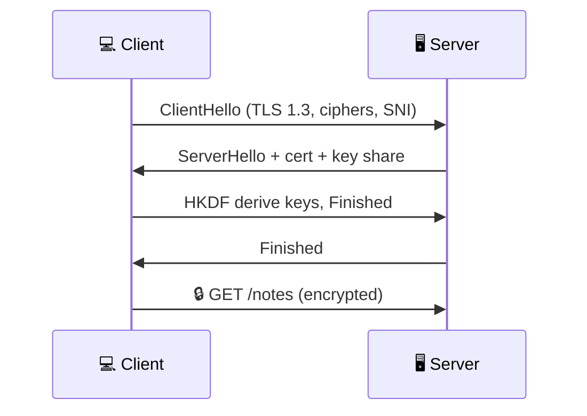
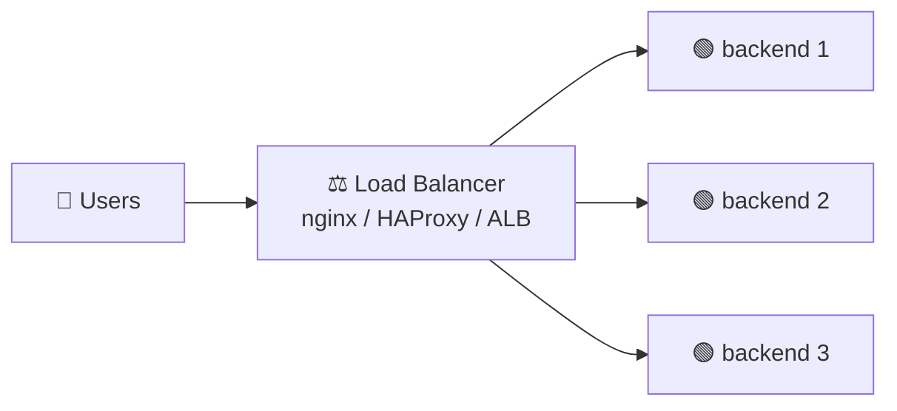
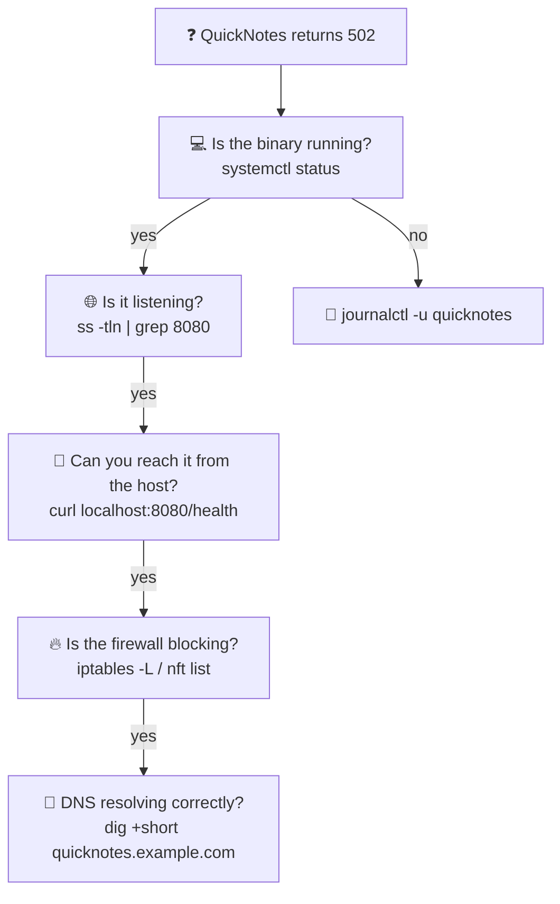
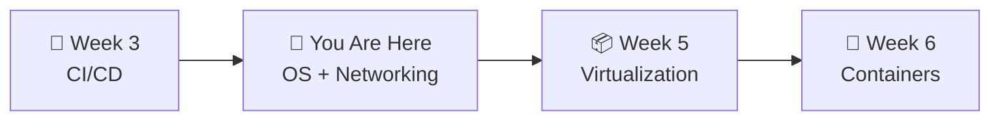

# 📌 Lecture 4 — Operating Systems & Networking: The Substrate Underneath Everything

---

## 📍 Slide 1 – 💥 The Day Facebook Disappeared from the Internet

* 🗓️ **October 4, 2021, 15:39 UTC** — Facebook engineers push a BGP configuration change that withdraws **all** Facebook's prefixes from the public internet
* 🚪 Within minutes, **DNS** servers (which lived inside those prefixes) become unreachable. Facebook, Instagram, WhatsApp, Oculus — **all gone**
* 🪦 **Six hours offline.** Engineers couldn't even badge into the building to physically fix it — the access-control system used the same DNS
* 💵 Estimated cost: **$60 million in lost revenue**, plus a 5% stock drop
* 🎓 **Lesson:** Every layer of your stack rides on networking and an operating system. When they fail, the world stops

> 🤔 **Think:** Where does your *deployment* end and the *substrate* begin? When something breaks, who debugs the OSI layer 3 problem — Dev or Ops?

---

## 📍 Slide 2 – 🎯 Learning Outcomes

| # | 🎓 Outcome |
|---|-----------|
| 1 | ✅ Sketch the OSI / TCP-IP stack and place real protocols on it |
| 2 | ✅ Trace a packet from `curl` to a remote server: DNS → TCP → TLS → HTTP |
| 3 | ✅ Read `ss`, `ip`, `dig`, `tcpdump`, `journalctl` output without flinching |
| 4 | ✅ Explain how systemd runs a service and what `systemctl status` reveals |
| 5 | ✅ Reason about UNIX permissions (`rwx`, `ugo`, `chmod`/`chown`) |
| 6 | ✅ Capture and analyze a packet trace of QuickNotes traffic |

---

## 📍 Slide 3 – 🗺️ Lecture Overview


* 📍 Slides 1-9 — Networking from OSI to TLS to load balancers
* 📍 Slides 10-15 — Linux: filesystem, processes, systemd, permissions
* 📍 Slides 16-18 — Debugging the substrate
* 📍 Slides 19-21 — Real incidents, Lab 4, takeaways

---

## 📍 Slide 4 – 📚 The OSI Model & Where Real Things Live

| Layer | Name | Real example | What you debug here |
|------:|------|--------------|---------------------|
| 7 | Application | HTTP, gRPC | `curl`, status codes |
| 6 | Presentation | TLS, JSON encoding | Cert chains |
| 5 | Session | (mostly folded in) | Sticky sessions |
| 4 | Transport | TCP, UDP, QUIC | `ss -tn`, retransmits |
| 3 | Network | IP, ICMP, BGP | `ip route`, `traceroute` |
| 2 | Data Link | Ethernet, ARP | `ip neigh` |
| 1 | Physical | Copper, fiber, radio | The blinking light |

* 🎯 In practice, DevOps work happens at **L3 (IP routing), L4 (TCP/load balancers), L7 (HTTP)**
* 🤣 The joke: *"It's never DNS. Until it is. Then it's always DNS."* — and DNS is L7 over UDP at L4 over IP at L3

---

## 📍 Slide 5 – 🌍 DNS: The First Thing That Breaks

```bash
# ✅ what IP does a name resolve to?
$ dig +short github.com
140.82.112.4

# ✅ which DNS server gave that answer?
$ dig github.com | grep SERVER
;; SERVER: 1.1.1.1#53(1.1.1.1)

# ✅ trace the resolution chain end-to-end
$ dig +trace github.com
```

| Record | Holds | Used for |
|--------|-------|----------|
| `A` | IPv4 address | Most lookups |
| `AAAA` | IPv6 address | IPv6 |
| `CNAME` | Alias to another name | "www → github.com" |
| `MX` | Mail exchange | Mail routing |
| `TXT` | Arbitrary text | SPF, DKIM, domain ownership |

* ⏳ **TTL** — how long a resolver may cache the answer. Low TTL = fast cutover, more queries
* 🧪 In Lab 4 you'll `dig` and `host` against the QuickNotes test domain

---

## 📍 Slide 6 – 📡 HTTP and What `curl` Actually Sends

```text
# ✅ raw request
GET /notes HTTP/1.1
Host: localhost:8080
User-Agent: curl/8.5.0
Accept: */*

# ✅ response
HTTP/1.1 200 OK
Content-Type: application/json
Content-Length: 245
```

| Code class | Meaning | Example |
|------------|---------|---------|
| **2xx** | Success | 200 OK, 201 Created, 204 No Content |
| **3xx** | Redirection | 301 Moved Permanently, 304 Not Modified |
| **4xx** | Client error | 400 Bad Request, 401 Unauth, 404 Not Found |
| **5xx** | Server error | 500 Internal, 502 Bad Gateway, 503 Unavailable |

* 🆕 **HTTP/2** (2015): multiplexing, header compression. **HTTP/3** (2022): QUIC over UDP, no head-of-line blocking
* 🧪 `curl -v http://localhost:8080/health` shows you everything below the JSON

---

## 📍 Slide 7 – 🔐 TLS in 90 Seconds



* 🪪 **The certificate** proves the server controls the domain (issued by a trusted CA)
* 🤝 **TLS 1.3** (2018): one round trip; old TLS 1.2 needed two
* 🆓 **Let's Encrypt** (since 2016) issues free, automated certs — kills the "pay $300/year for HTTPS" excuse
* 🔍 Check a server's cert:
```bash
openssl s_client -connect github.com:443 -servername github.com </dev/null | openssl x509 -noout -dates
```

> 💡 The padlock in your browser only means **encryption + identity-of-domain**. Not "this site is honest."

---

## 📍 Slide 8 – ⚖️ Load Balancing: One Service, Many Backends



| L4 LB | L7 LB |
|-------|-------|
| Routes by IP:port | Routes by URL path, host, header |
| Faster, dumber | Smarter, can do TLS termination |
| Example: `iptables`, AWS NLB | nginx, HAProxy, AWS ALB |

* 🔁 Algorithms: round-robin, least-connections, IP-hash (sticky)
* 💊 **Health checks** decide which backends get traffic — bad health-check thresholds caused the **2017 GitHub `git-backend` outage**
* 🐧 In Lab 4 you'll inspect how Docker Compose itself runs a tiny L4 LB via its embedded DNS

---

## 📍 Slide 9 – 🔍 Debugging the Network: Five Commands

```bash
# 1) what's listening?
ss -tln

# 2) what routes do I have?
ip route show

# 3) can I reach the target?
mtr -rwc 5 github.com    # combines ping + traceroute

# 4) what's the wire actually carrying?
sudo tcpdump -i lo -nn -A 'tcp port 8080'

# 5) is DNS the problem?
dig +short example.com @1.1.1.1
```

* 🪤 `netstat` is **deprecated** — `ss` is the modern replacement (faster, more output)
* 🔍 Wireshark / `tcpdump` decode packets all the way up to L7 — invaluable for "the response was wrong" bugs
* 🆓 **Lab 4 Task 1** runs all five against a live QuickNotes server

---

## 📍 Slide 10 – 🐧 Linux File System Hierarchy

```text
/             # root of everything
├── bin/      # essential user binaries (ls, cat, sh)
├── boot/     # kernel + bootloader files
├── etc/      # system configuration
│   ├── systemd/
│   ├── ssh/
│   └── nginx/
├── home/     # per-user homes
├── var/
│   ├── log/      # logs (text, often the FIRST place to look)
│   ├── lib/      # service data (postgres, docker)
│   └── cache/    # cacheable, regenerable
├── tmp/      # ephemeral; often a tmpfs
├── proc/     # virtual: process & kernel info
├── sys/      # virtual: kernel objects
└── usr/      # user-installed packages
```

* 🤓 **FHS** (Filesystem Hierarchy Standard) — a real spec, not folklore
* 🧪 `/proc/$PID/status`, `/proc/$PID/limits` are how `ps`, `top`, debuggers actually work
* 📝 *"Everything is a file"* — including network sockets in `/proc/$PID/net/tcp`

---

## 📍 Slide 11 – 🔄 Processes & Signals

```bash
# ✅ tree of processes
ps auxf | less

# ✅ live view
top    # or `htop` for the modern, color one

# ✅ stop a process politely (SIGTERM, give it time to clean up)
kill 12345

# ⚠️ stop it brutally (SIGKILL, no chance to flush)
kill -9 12345
```

| Signal | Number | Meaning |
|--------|-------:|---------|
| SIGHUP | 1 | Reload config (convention) |
| SIGINT | 2 | Ctrl-C |
| **SIGTERM** | 15 | Default `kill` — graceful |
| **SIGKILL** | 9 | Uncatchable, immediate |
| SIGSTOP | 19 | Pause until SIGCONT |

* 🛡️ QuickNotes (`main.go`) traps SIGTERM and runs an `http.Server.Shutdown` — that's a graceful drain. Lab 4 Task 1 verifies it.

---

## 📍 Slide 12 – 🔧 systemd: How Linux Runs Services

```ini
# /etc/systemd/system/quicknotes.service
[Unit]
Description=QuickNotes API
After=network-online.target

[Service]
ExecStart=/usr/local/bin/quicknotes
Restart=on-failure
RestartSec=2
User=quicknotes
Environment=ADDR=:8080

[Install]
WantedBy=multi-user.target
```

```bash
sudo systemctl daemon-reload
sudo systemctl enable --now quicknotes
sudo systemctl status quicknotes
journalctl -u quicknotes -f       # tail logs
```

* 🎯 systemd unifies init, logging (journald), cron (timers), and process supervision
* 🧪 **Lab 7** (Ansible) will write this exact unit file via a playbook

---

## 📍 Slide 13 – 🔐 UNIX Permissions

```bash
$ ls -l app/main.go
-rw-r--r-- 1 quicknotes quicknotes 1.2K Mar 12 10:42 main.go
 │ │  │  │  └ group: quicknotes
 │ │  │  └── owner: quicknotes
 │ │  └───── other: r--
 │ └──────── group: r--
 └────────── owner: rw-
```

| Mode | Symbolic | Octal | Means |
|------|----------|-------|-------|
| Owner rw, group r, other r | `rw-r--r--` | **644** | Common for files |
| Owner rwx, group rx, other rx | `rwxr-xr-x` | **755** | Common for binaries / dirs |
| Owner rwx, no one else | `rwx------` | **700** | SSH keys, secrets |
| `setuid` bit | `rwsr-xr-x` | **4755** | Runs as the file's owner (e.g. `passwd`) |

* 🛡️ Never `chmod 777` to "make it work" — it's the security equivalent of `git push --force` to main
* 🧰 `chmod`, `chown`, `umask` — practice all three in Lab 4

---

## 📍 Slide 14 – 📜 Logs: journalctl + `/var/log/`

```bash
# everything since boot
journalctl -b

# only the quicknotes unit, follow live
journalctl -u quicknotes -f

# JSON output for piping into jq
journalctl -u quicknotes -o json | jq '.MESSAGE'

# old-school text logs still exist
tail -f /var/log/nginx/access.log
```

* 🗃️ journald stores structured logs; text files in `/var/log/` are still common for daemons that pre-date systemd
* 🔁 **Log rotation** — `logrotate(8)` compresses old logs nightly. Forgetting to configure it = disk full = outage
* 🧪 In Lab 8 you'll ship these logs to Grafana Loki — but Lab 4 just teaches you to *read* them

---

## 📍 Slide 15 – 🛠️ Useful Linux Tools Cheat Sheet

| Need to | Tool | Modern? |
|---------|------|---------|
| List files | `ls -la` | `eza` (rusty rewrite) |
| Find a file | `find . -name 'main.go'` | `fd` |
| Search file contents | `grep -rn TODO .` | `ripgrep` (`rg`) |
| Watch a metric | `watch -n 1 'free -h'` | `btop`, `htop` |
| Pretty `cat` | `cat file` | `bat` |
| Diff | `diff -u a b` | `delta` |

* ⚙️ The **modern** tools are written in Rust/Go, faster, with better UX. None are required — the classics still work
* 🐢 Avoid `find / 2>/dev/null` — it scans your *entire filesystem*. Always start from a directory you know

---

## 📍 Slide 16 – 🩻 Debugging Substrate Failures



* 🧠 Always work **outside-in** — start with the symptom, peel back layers
* 🧪 Lab 4 Task 2 walks this exact chain for a deliberately-broken QuickNotes deploy

---

## 📍 Slide 17 – ❌ Common Antipatterns

| 🔥 Antipattern | ✅ Better |
|----------------|----------|
| `sudo` everywhere because "it works" | Diagnose the permission, then add the *narrow* capability |
| `chmod 777 /var/something` to fix an upload | Find the right user/group, `chown` + `chmod 770` |
| Running services as `root` | Dedicated user; `User=quicknotes` in the systemd unit |
| Editing `/etc/hosts` to "fix DNS" | Fix DNS instead — host overrides drift between machines |
| Logging to a file in `/tmp` (cleared on reboot) | Log to stdout (journald captures it) |
| `ps aux | grep myproc` to "check if running" | `systemctl is-active myproc` — exit code is reliable |

---

## 📍 Slide 18 – 🔥 Real Story: It Wasn't DNS… It Was BGP

* 🗓️ **October 4, 2021** — Facebook's planned BGP maintenance withdraws all routes to FB's data centers
* 🪦 As a side effect, DNS servers (inside those data centers) become unreachable. Every cached answer eventually expires. The internet **forgets Facebook exists**
* 🚪 On-site engineers can't fix it remotely (no VPN), and **the badge readers used the same DNS** — so they can't physically enter the building
* ⌛ Total outage: **~6 hours**, ~$60M direct loss
* 🎓 The lesson is **dependency mapping**: your monitoring, your access control, your remote console all *also* live on the network they're supposed to fix

> 📝 **Read:** [Cloudflare's blog on the FB outage (Oct 2021)](https://blog.cloudflare.com/october-2021-facebook-outage/) — best outside narrative of what happened

---

## 📍 Slide 19 – 🧪 Lab 4 Preview

* 🛠️ **Task 1 (6 pts):** Run QuickNotes locally. Use `ss`, `dig`, `tcpdump`, `curl -v` to map exactly what the network does when a single `POST /notes` happens
* 🩺 **Task 2 (4 pts):** Walk a deliberately-broken deploy through the outside-in debugging chain — find the root cause, document it as a mini-postmortem
* 🎁 **Bonus (2 pts):** Capture the TLS handshake with `tcpdump`, then decode `ClientHello` + `ServerHello` with Wireshark
* 📜 Deliverable: `submissions/lab4.md` with packet timestamps, output snippets, and a one-paragraph "what surprised me"

---

## 📍 Slide 20 – 🧠 Key Takeaways

1. 🌐 **Every deploy rides on networking and an OS** — when those fail, your app fails, but the *fix* is at a lower layer
2. 🔍 **DNS is almost always involved** — but it's worth checking BGP, firewall, and TLS too
3. 🐧 **systemd is the default front door** — unit files, journalctl, restarts; learn them once, use them everywhere
4. 🛠️ **`ss`, `dig`, `tcpdump`, `journalctl`** are your tier-1 debugging tools — every DevOps engineer should be fluent
5. 🛡️ **Permissions matter** — `777` is not a fix
6. 🤝 **The dependency graph is recursive** — your monitoring is a service. Your access control is a service. Plan for them to fail

---

## 📍 Slide 21 – 🚀 What's Next + 📚 Resources

* 📍 **Next lecture:** Virtualization — running QuickNotes inside a VM, then comparing to a container
* 🧪 **Lab 4:** Network capture + Linux debugging on QuickNotes (Task 1 + Task 2 + Bonus TLS dump)
* 📖 **Read this week:**
  * 📕 *TCP/IP Illustrated, Vol. 1* — W. Richard Stevens — Chapters 1-4 (lifelong reference)
  * 📗 *The Linux Programming Interface* — Michael Kerrisk — Chapters 1-3, 27 (processes), 35 (signals)
  * 📘 [Brendan Gregg — Linux Performance](https://www.brendangregg.com/linuxperf.html) — the diagram is *the* Linux performance cheat-sheet
  * 📝 [Cloudflare on the 2021 Facebook outage](https://blog.cloudflare.com/october-2021-facebook-outage/)
* 🛠️ **Tools to install this week:** `dig`, `ss`, `tcpdump`, `mtr`, `htop`, `jq`, `ripgrep`



> 🎯 **Remember:** The substrate isn't glamorous, but it's where every "production outage" actually lives. The engineers who can debug it become very valuable, very fast.
