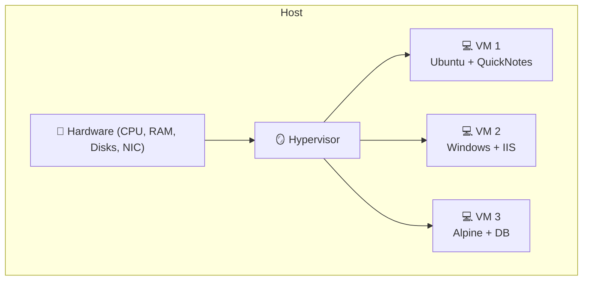
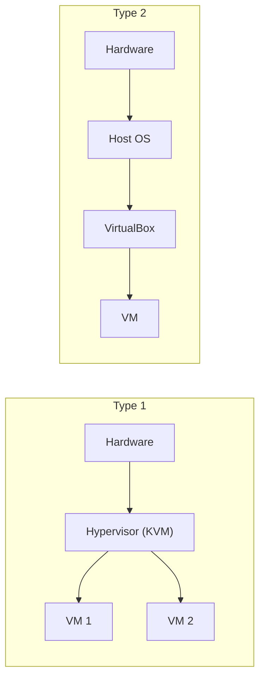
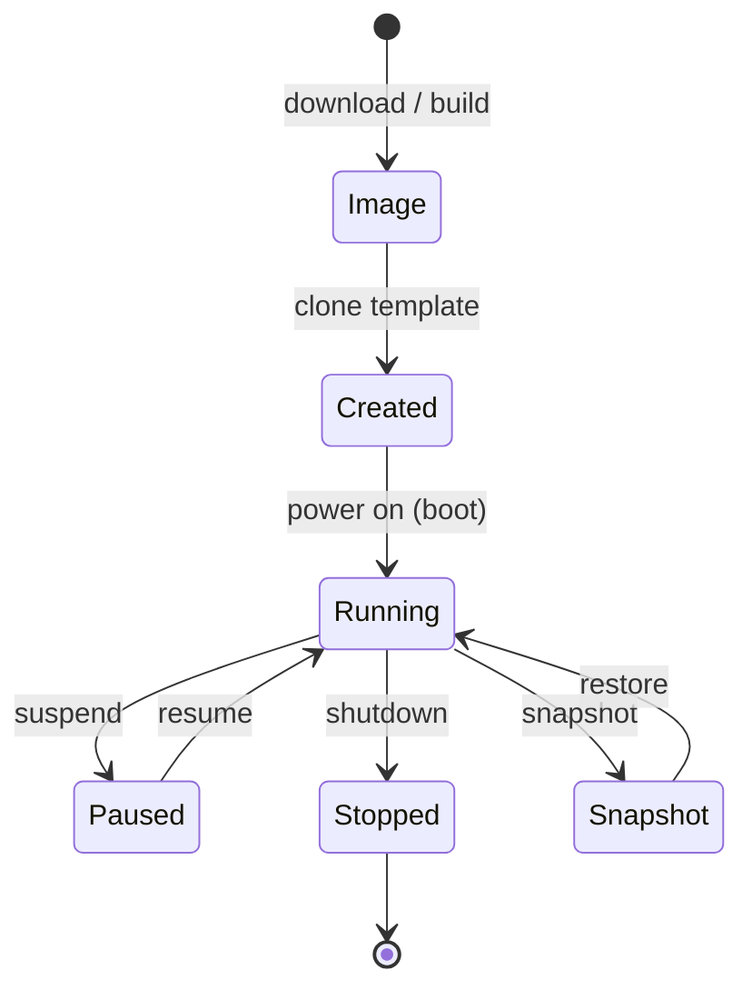
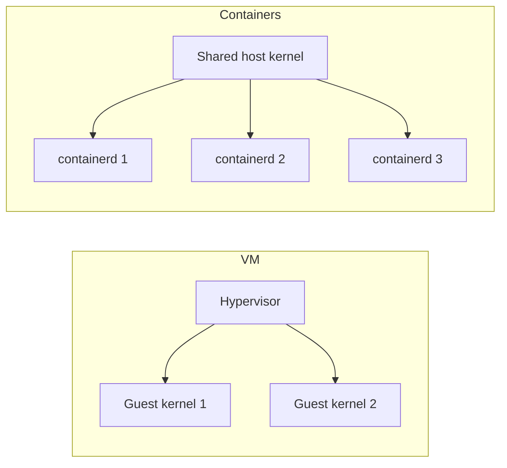
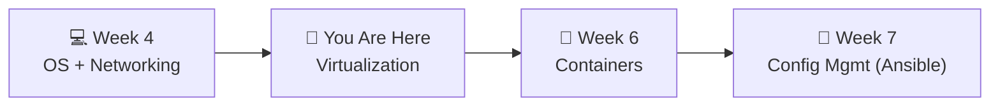

# 📌 Lecture 5 — Virtualization: One Box, Many Worlds

---

## 📍 Slide 1 – 💥 The Day VMware Saved a Datacenter

* 🗓️ **2002** — Diane Greene's team at VMware demos ESX Server, the first production hypervisor for x86
* 🪦 Before ESX: a typical datacenter ran **5-10% CPU utilization** because every app needed a dedicated box "to be safe"
* 📈 After ESX: enterprises consolidated **10:1, 20:1, 50:1** — entire physical rooms emptied of servers, costs dropped 70%
* 🚀 The pattern made AWS possible: by **August 2006**, EC2 launched, renting **virtual** machines by the hour
* 🎓 **Lesson:** Software pretending to be hardware unlocked the entire cloud era

> 🤔 **Think:** Before virtualization, "deploying QuickNotes" meant buying a server, racking it, and installing Linux. How would your weekend look?

---

## 📍 Slide 2 – 🎯 Learning Outcomes

| # | 🎓 Outcome |
|---|-----------|
| 1 | ✅ Distinguish Type 1 vs Type 2 hypervisors with examples |
| 2 | ✅ Explain what a VM image actually is (and isn't) |
| 3 | ✅ Snapshot, restore, clone — the three superpowers a VM gives you |
| 4 | ✅ Compare VM vs container (preview of Lecture 6) |
| 5 | ✅ Spin a Linux VM in VirtualBox and SSH into it |
| 6 | ✅ Use Vagrant to make VM setup reproducible (declarative, in Git) |

---

## 📍 Slide 3 – 🗺️ Lecture Overview


* 📍 Slides 1-7 — VM fundamentals
* 📍 Slides 8-12 — Lifecycle, images, snapshots
* 📍 Slides 13-16 — Vagrant + the QuickNotes VM
* 📍 Slides 17-21 — VM vs container, real story, takeaways

---

## 📍 Slide 4 – 💾 What Is a Virtual Machine, Really?

A VM is a **software emulation** of a complete computer — its own CPU, RAM, disks, NIC — running on top of real hardware.



* 🪞 The **hypervisor** is the magic layer that fools each VM into thinking it has the whole machine
* 🆔 The VM has its own **kernel** — that's the key difference from a container (next lecture)
* ⏳ Hardware features make this fast: Intel **VT-x** (2005), AMD-V (2006), nested page tables (2008)

---

## 📍 Slide 5 – 🏛️ Type 1 vs Type 2 Hypervisors

| | Type 1 (Bare-metal) | Type 2 (Hosted) |
|---|---------------------|-----------------|
| Where it sits | Directly on hardware | On top of a host OS |
| Examples | VMware ESXi, Microsoft Hyper-V, KVM (Linux kernel), Xen | VirtualBox, VMware Workstation, Parallels |
| Performance | Closer to bare metal | A few % slower (host OS overhead) |
| Use case | **Datacenter / cloud** | **Developer laptops** |



* 🧪 In this lab you'll use **VirtualBox** (Type 2) — free, cross-platform, perfect for learning
* 🏛️ AWS EC2, GCP Compute, every "cloud VM" is **KVM** (Type 1) behind the scenes

---

## 📍 Slide 6 – 📜 A Short History of x86 Virtualization

* 🖥️ **1972** — IBM ships VM/370 on mainframes — virtualization was already old then
* 🤔 **1999** — VMware founders prove you *can* virtualize x86 even though the architecture wasn't designed for it (binary translation)
* 🏎️ **2005-2006** — Intel VT-x and AMD-V add hardware support → 2-5× speedup
* 🐧 **2007** — KVM merges into the Linux kernel; suddenly *every* Linux box is a hypervisor
* ☁️ **2006-2008** — AWS launches EC2, S3, RDS — the cloud era is here
* 🧪 **2013-2015** — Docker and Kubernetes start to eat the VM's lunch (Lecture 6)

> 💡 Virtualization didn't replace bare metal — it added an option. Cloud + containers didn't replace VMs — they added more options. **Pick the right tool, not the new tool.**

---

## 📍 Slide 7 – 🛠️ VM Lifecycle: From Image to Running



| State | What it is | Disk footprint |
|-------|------------|----------------|
| **Image** | Cold file on disk (.vdi, .qcow2, .ova) | Base size |
| **Created** | VM exists in inventory but never booted | Same as image |
| **Running** | CPU + RAM allocated, OS executing | + RAM size on disk if paged |
| **Snapshot** | Copy-on-write fork of the disk | Δ from base |
| **Paused** | RAM dumped to disk, VM frozen | + RAM file |

---

## 📍 Slide 8 – 📦 VM Images & Disk Formats

| Format | Origin | Compression | Snapshots |
|--------|--------|-------------|-----------|
| `.vdi` | VirtualBox | ✅ | ✅ |
| `.qcow2` | QEMU/KVM | ✅ | ✅ (copy-on-write) |
| `.vmdk` | VMware | ✅ | ✅ |
| `.vhd / .vhdx` | Microsoft | ✅ | ✅ |
| `.ova / .ovf` | Open Virtualization Format | ✅ (tar of VM + metadata) | — |

* 📁 An **image** is a file. You can copy it, version it, scan it
* 🆔 **Cloud images** (Ubuntu cloud-images, Amazon Linux) are pre-baked with `cloud-init` so they boot, accept your SSH key, install your packages, with no manual interaction
* 🧰 `qemu-img convert -f qcow2 -O vdi src.qcow2 dst.vdi` — convert between formats

---

## 📍 Slide 9 – 📸 Snapshots: The Time Machine

```bash
# VirtualBox CLI
$ VBoxManage snapshot quicknotes-vm take pre-deploy
$ VBoxManage snapshot quicknotes-vm restore pre-deploy
$ VBoxManage snapshot quicknotes-vm delete pre-deploy
```

* ⏪ A snapshot freezes the VM's disk + memory state at a moment in time
* 🪤 **Copy-on-write** — the snapshot doesn't duplicate the disk; only changed blocks are written
* ⚠️ Snapshots are **not** backups — they live on the same disk. A failing disk takes both
* 🚫 Don't run a VM on dozens of snapshots — every read traverses the chain. Snapshot, restore, **delete**

> 💡 In Lab 5, you'll snapshot a clean QuickNotes VM, deliberately break it, restore in 30 seconds.

---

## 📍 Slide 10 – 🔗 VM Networking: Three Modes

| Mode | What it does | When to use |
|------|--------------|-------------|
| **NAT** | VM gets a private IP, shares host's IP for outbound | Default; just need internet from VM |
| **Bridged** | VM gets an IP on the same LAN as the host | Other machines on the LAN can reach the VM |
| **Host-only** | Isolated network between host ↔ VM (no internet) | Lab environments, secret testing |

```bash
# VirtualBox: tell the VM to forward host port 8080 → VM port 8080
$ VBoxManage modifyvm quicknotes-vm \
    --natpf1 "quicknotes,tcp,127.0.0.1,8080,,8080"
```

* 🧪 Lab 5 uses **NAT with port forwarding** so `curl localhost:8080/notes` from your host reaches QuickNotes inside the VM

---

## 📍 Slide 11 – 📜 Vagrant: Make VMs Reproducible

Vagrant turns "click through 27 GUI screens" into a single text file in Git:

```ruby
# Vagrantfile
Vagrant.configure("2") do |config|
  config.vm.box      = "ubuntu/jammy64"
  config.vm.hostname = "quicknotes-vm"
  config.vm.network "forwarded_port", guest: 8080, host: 18080

  config.vm.provider "virtualbox" do |vb|
    vb.memory = 1024
    vb.cpus   = 2
  end

  config.vm.provision "shell", inline: <<-SHELL
    apt-get update && apt-get install -y curl
  SHELL
end
```

```bash
vagrant up        # build + boot
vagrant ssh       # log in
vagrant snapshot save clean-quicknotes
vagrant destroy   # nuke it from orbit
```

* 📝 **One file = one reproducible VM.** Commit it. Diff it. Code-review it
* 🧪 Lab 5 ships you a `Vagrantfile` as plumbing; you'll customize provisioning

---

## 📍 Slide 12 – 🚀 cloud-init: The Other Half of Reproducibility

For cloud VMs, **cloud-init** is the universal first-boot configurator:

```yaml
#cloud-config
hostname: quicknotes
users:
  - name: deploy
    ssh-authorized-keys: [ssh-ed25519 AAAA...]
    sudo: ALL=(ALL) NOPASSWD:ALL
packages:
  - curl
  - jq
runcmd:
  - systemctl enable --now quicknotes
write_files:
  - path: /etc/quicknotes/env
    content: |
      ADDR=:8080
```

* 🌐 Supported by AWS, GCP, Azure, OpenStack, DigitalOcean — every cloud
* 🧪 Lab 10 will use cloud-init to spin a Cloud Run-adjacent test VM
* 📚 The same YAML works in Vagrant too

---

## 📍 Slide 13 – 📈 Resource Sizing: How Much Is Enough?

| Workload | vCPU | RAM | Disk |
|----------|-----:|----:|-----:|
| Idle Linux + sshd | 1 | 256 MB | 1 GB |
| QuickNotes (this course) | 1 | 512 MB | 2 GB |
| Postgres dev DB | 2 | 2 GB | 10 GB |
| Build/CI runner | 4 | 8 GB | 20 GB |

* 📊 **Over-provisioning** wastes money in the cloud and host RAM on your laptop
* 📉 **Under-provisioning** triggers OOM kills, swap thrashing, mystery slowness
* 🧰 `free -h`, `vmstat 1`, `iostat 1` — measure before you guess
* 💡 In Lab 8 (SRE) you'll learn to size based on **observed** load, not guessed load

---

## 📍 Slide 14 – 🐳 VM vs Container: The 30-Second Preview

| | Virtual Machine | Container |
|---|-----------------|-----------|
| Has its own kernel? | ✅ Yes | ❌ Shares host kernel |
| Boot time | 30-90 s | 1-3 s |
| Disk size | 1-10 GB | 5-200 MB |
| Strong isolation | ✅ Hardware-level | ⚠️ Namespace + cgroup level |
| Lifetime | Days to years | Seconds to days |
| Use it for | Multi-tenant clouds, full OS choice | Microservices, CI jobs, dev environments |



* 🤝 In production, containers usually run *inside* VMs (cloud-provided isolation + container density)
* 🎯 Next lecture: containers in depth

---

## 📍 Slide 15 – 🧪 Lab 5 Preview: QuickNotes in a VM

* 🛠️ **Task 1 (6 pts):** `vagrant up` a Ubuntu 24.04 VM, install Go, build QuickNotes inside, expose `:8080` to the host, hit it with `curl` from your laptop
* 📸 **Task 2 (4 pts):** Snapshot the clean VM, deliberately break the binary, restore the snapshot, measure recovery time
* 🎁 **Bonus (2 pts):** Compare boot time + RAM footprint of a Vagrant VM vs running QuickNotes in a Docker container (preview of Lab 6)
* 📜 Deliverable: `submissions/lab5.md` with `vagrant up` log, snapshot timestamps, and a one-paragraph reflection

---

## 📍 Slide 16 – ❌ Common VM Antipatterns

| 🔥 Antipattern | ✅ Better |
|----------------|----------|
| GUI-click your way through VM setup, then "remember" what you did | Vagrantfile + cloud-init = version-controlled |
| Run a VM on a chain of 20 snapshots | Use snapshots transiently; delete after restore |
| Allocate 16 vCPU on a 4-core host | Over-provisioning leads to thrashing — cap at host cores |
| Skip `apt-get update` in provisioning ("the image was new last month") | Build images with **Packer**; pin versions; refresh weekly |
| Treat VM as a pet ("**this** is the build server") | Treat VM as cattle — destroyable + rebuildable in one command |

---

## 📍 Slide 17 – 📜 Real Story: Heartbleed and the Patch Storm

* 🗓️ **April 7, 2014** — Heartbleed (CVE-2014-0160) disclosed: any TLS-using OpenSSL server can be remotely memory-dumped
* 🧨 ~17% of the public internet's HTTPS servers were vulnerable
* 🏃 At cloud scale, this meant **rebuilding tens of thousands of VM images** from base + new OpenSSL + redeploying
* 🛠️ Companies with proper image-pipelines (Packer + version-controlled cloud-init) shipped patches in **hours**. Companies that hand-built VMs took **weeks**
* 🎓 **Lesson:** If you can't rebuild a VM from a text file, you can't respond to a CVE at speed

> 💬 *"Treat your servers like cattle, not pets."* — Bill Baker (Microsoft, 2012) — and Heartbleed was the moment that became survival, not philosophy

---

## 📍 Slide 18 – 🧠 Key Takeaways

1. 💾 **A VM is software pretending to be hardware** — its own kernel, its own networking, its own everything
2. 🏛️ **Type 1 = bare-metal hypervisor (datacenter), Type 2 = hosted (laptop)** — same idea, different host
3. 📸 **Snapshots are time machines, not backups** — same disk, same failure domain
4. 📜 **Vagrant + cloud-init make VMs declarative** — commit the file, not the clicks
5. 🐳 **VMs and containers are complementary, not competitive** — containers run *inside* VMs in production
6. 🐄 **Treat servers like cattle** — when you can rebuild from text, you can survive Heartbleed-class events

---

## 📍 Slide 19 – 🚀 What's Next + 📚 Resources

* 📍 **Next lecture:** Containers — same OS, lighter isolation, faster everything
* 🧪 **Lab 5:** Vagrant + VirtualBox + QuickNotes; snapshot lifecycle; resource comparison
* 📖 **Read this week:**
  * 📕 *Modern Operating Systems* — Andrew Tanenbaum — Chapter 7 (Virtualization)
  * 📗 [VMware Workstation paper (1999)](https://www.usenix.org/legacy/event/wiess02/full_papers/sapuntzakis/sapuntzakis.pdf) — how they made x86 virtualization work
  * 📘 [Vagrant docs](https://developer.hashicorp.com/vagrant/docs) — start with "Getting Started"
  * 📝 [Cloudflare on Heartbleed (2014)](https://blog.cloudflare.com/answering-the-critical-question-can-you-get-private-ssl-keys-using-heartbleed/) — real-time analysis of the attack
* 🛠️ **Tools to install this week:** VirtualBox 7.1.x, Vagrant 2.4.x



> 🎯 **Remember:** Virtualization was the abstraction that made everything else — clouds, containers, immutable infrastructure — possible. The pattern (run *N* tenants on shared hardware via a thin abstraction layer) keeps repeating.
