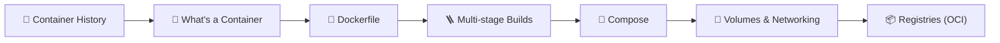
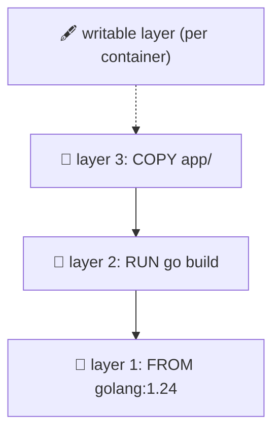
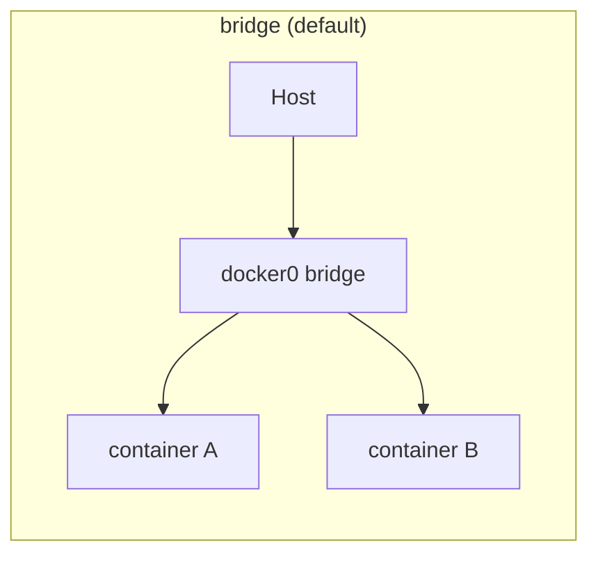
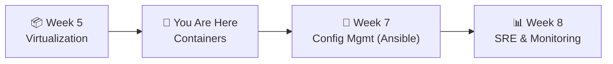

# 📌 Lecture 6 — Containers: Same Kernel, Different Worlds

---

## 📍 Slide 1 – 💥 The Tweet That Started It

* 🗓️ **March 15, 2013, PyCon** — Solomon Hykes demos **Docker** for the first time, 5 minutes after lunch
* 🎬 The demo: a Python app, a Redis container, a MySQL container — all running on one laptop in seconds, no VM boot, no `apt-get`
* 🐦 By the end of the year Docker has **20,000 GitHub stars** and a **container Cambrian explosion** is on
* 🏗️ Kubernetes (2014), Docker Swarm (2014), the OCI standards (2015), ECS (2014), GKE (2014), CNCF (2015) — all of it within 24 months of that demo
* 🎓 **Lesson:** Containers weren't new (chroot is from 1979). Docker made them **ergonomic** — and ergonomics is what wins

> 🤔 **Think:** You ran QuickNotes in a VM last week. Same code in a container this week boots in 200 ms instead of 60 s. What stopped being "OS" and became "shared kernel"?

---

## 📍 Slide 2 – 🎯 Learning Outcomes

| # | 🎓 Outcome |
|---|-----------|
| 1 | ✅ Explain what a container actually is (process + namespaces + cgroups) |
| 2 | ✅ Read and write a Dockerfile that builds in under 30 seconds |
| 3 | ✅ Use a **multi-stage build** to ship a 15 MB Go image |
| 4 | ✅ Run multi-service stacks with **Docker Compose** |
| 5 | ✅ Distinguish **volumes** from **bind mounts** and use each correctly |
| 6 | ✅ Push and pull images from a registry; know what an OCI image *is* |

---

## 📍 Slide 3 – 🗺️ Lecture Overview



* 📍 Slides 1-5 — Origin and the kernel features underneath
* 📍 Slides 6-10 — Dockerfile and image construction
* 📍 Slides 11-14 — Compose, networking, volumes
* 📍 Slides 15-18 — Registries, security, antipatterns
* 📍 Slides 19-21 — Lab 6 + takeaways

---

## 📍 Slide 4 – 📜 Containers Are 45 Years Old

| Year | What | Why it mattered |
|-----:|------|-----------------|
| 1979 | `chroot(2)` on Unix v7 | A process can have a fake `/` — the earliest filesystem jail |
| 2000 | FreeBSD jails | chroot + network + process isolation |
| 2004 | Solaris Zones | Production-grade containers on Solaris |
| 2006 | Linux **cgroups** (Google "process containers") | Limit CPU/RAM/IO per process group |
| 2008 | Linux **namespaces** + LXC | Isolated PID/NET/MNT/UTS/IPC views |
| 2013 | **Docker** | UX over LXC: Dockerfile, image layers, registry |
| 2015 | **OCI** (Open Container Initiative) | Standardized the image + runtime spec |
| 2015 | **Kubernetes 1.0** | Orchestration eats the world |

> 💬 *"Docker didn't invent containers. Docker invented the workflow."* — folklore

---

## 📍 Slide 5 – 🧠 What a Container Actually Is

A container is **a process** with three Linux-kernel tricks layered on top:

| Trick | Limits the container's view of... | Kernel feature |
|-------|-----------------------------------|----------------|
| 🪪 **Namespaces** | PIDs, network, mounts, hostname, users, IPC | `clone()` flags |
| 📏 **cgroups (v2)** | CPU shares, memory limit, IO bandwidth | `/sys/fs/cgroup` |
| 🛡️ **Capabilities + seccomp** | Which syscalls and root powers the process gets | `cap_t`, BPF filters |

```bash
# ✅ a container is just a process — see for yourself
$ docker run -d --name qn quicknotes
$ ps -ef | grep quicknotes
$ ls /proc/$PID/ns/      # namespace fds
$ cat /proc/$PID/cgroup  # cgroup membership
```

* 🎯 No "container kernel" — that's the difference from a VM
* 🛡️ Weaker isolation than a VM, but **a hundred** containers fit where one VM did

---

## 📍 Slide 6 – 🥞 Image Layers: Read-Only Cake



* 📦 Every `RUN`, `COPY`, `ADD` in a Dockerfile creates a **layer** — a read-only tarball
* 🥡 An image = ordered stack of layers + a manifest (the OCI image spec)
* 🔁 Layers are **content-addressed** (SHA-256) → identical layers across images stored **once**
* ⚡ This is why `docker build` is fast on rebuild: unchanged layers come from cache

---

## 📍 Slide 7 – 📄 The Dockerfile, Sample

```dockerfile
# ✅ pin the base image (don't use :latest)
FROM golang:1.24-alpine
WORKDIR /src
COPY go.mod go.sum ./
RUN go mod download
COPY . .
RUN go build -o /quicknotes
EXPOSE 8080
ENTRYPOINT ["/quicknotes"]
```

| Directive | What it does | Cacheable? |
|-----------|--------------|-----------|
| `FROM` | Base image — start of the layer stack | ✅ |
| `COPY` / `ADD` | Copy files in | ✅ (until source changes) |
| `RUN` | Execute in a new layer | ✅ (until command/predecessors change) |
| `ENV` / `WORKDIR` | Metadata + per-layer dir | ✅ |
| `EXPOSE` | **Documentation only** — doesn't open ports | ✅ |
| `ENTRYPOINT` / `CMD` | What runs when container starts | ✅ |

* 🪤 `EXPOSE 8080` doesn't publish the port — `docker run -p 8080:8080` does

---

## 📍 Slide 8 – 🪜 Multi-Stage Builds: 800 MB → 15 MB

```dockerfile
# ─── builder stage ───
FROM golang:1.24-alpine AS builder
WORKDIR /src
COPY go.mod go.sum ./
RUN go mod download
COPY . .
RUN CGO_ENABLED=0 go build -trimpath -ldflags='-s -w' -o /quicknotes

# ─── runtime stage ───
FROM gcr.io/distroless/static:nonroot
COPY --from=builder /quicknotes /quicknotes
COPY seed.json /seed.json
EXPOSE 8080
USER nonroot
ENTRYPOINT ["/quicknotes"]
```

* 📦 **Builder stage** has Go toolchain, modules, source — fat but discarded
* 🪶 **Runtime stage** has only the static binary on `distroless/static` — **no shell, no apt, no CVEs in `libc`**
* 📉 QuickNotes goes from `golang:1.24` (~900 MB) to `~15 MB` — fits a registry CDN's free tier

---

## 📍 Slide 9 – ⚡ Layer-Cache Discipline: COPY in the Right Order

```dockerfile
# ❌ BAD — every code change invalidates the deps layer
COPY . .
RUN go mod download
RUN go build

# ✅ GOOD — deps cached independent of source
COPY go.mod go.sum ./
RUN go mod download
COPY . .
RUN go build
```

* 🎯 **Most-stable inputs first.** `go.mod` changes weekly; your source changes hourly
* 🐍 Same idea for Python (`requirements.txt`), Node (`package.json + lock`), Rust (`Cargo.toml + lock`)
* 🤖 Modern builds use **BuildKit** (default in Docker since 23.x) — better cache, parallel stages, mount cache

---

## 📍 Slide 10 – 🎼 Docker Compose: Multi-Service Made Simple

```yaml
# compose.yaml
services:
  quicknotes:
    build: ./app
    ports: ["8080:8080"]
    environment:
      ADDR: ":8080"
      DATA_PATH: "/data/notes.json"
    volumes:
      - quicknotes-data:/data
    depends_on: [redis]
    healthcheck:
      test: ["CMD", "wget", "-qO-", "http://localhost:8080/health"]
      interval: 5s
      retries: 3

  redis:
    image: redis:7-alpine
    healthcheck:
      test: ["CMD", "redis-cli", "ping"]

volumes:
  quicknotes-data:
```

* 🪄 `docker compose up --build -d` boots the whole world; `down -v` tears it down (with volumes)
* 💊 `healthcheck:` lets `depends_on` actually wait for "ready"

---

## 📍 Slide 11 – 🌐 Container Networking in 3 Pictures



| Mode | What happens | When to use |
|------|--------------|-------------|
| `bridge` (default) | Each container on a private subnet behind NAT; Compose creates one per project | The default — almost always what you want |
| `host` | Container shares the host's network stack — **no isolation** | Performance-critical, single-tenant |
| `overlay` | Containers across multiple hosts on a virtual network | Swarm / multi-host setups |
| `none` | No network | Highly-restricted batch jobs |

* 🔍 `docker inspect <container>` → JSON shows the IP, NetworkMode, ports
* 🪤 The default `bridge` allows DNS by container name (`http://quicknotes:8080`) inside the same Compose project

---

## 📍 Slide 12 – 💾 Volumes vs Bind Mounts

| | Bind mount | Named volume |
|---|------------|--------------|
| Source | Host filesystem path you pick | Docker-managed, in `/var/lib/docker/volumes/` |
| Use it for | Editing source from your editor in dev | Persistent service data (DBs, app state) |
| Survives `docker rm`? | ✅ (it's on the host) | ✅ |
| Backups | You own the path | `docker run --rm -v vol:/src -v $PWD:/dst alpine tar czf /dst/v.tgz -C /src .` |
| Permissions risk | High — UID/GID mismatch | Lower |

```bash
# bind mount (dev)
docker run -v $PWD/app:/src golang:1.24 ...

# named volume (prod)
docker run -v quicknotes-data:/data quicknotes
```

* 🚫 `tmpfs:` mounts are RAM-backed and disappear on stop — useful for `/tmp` inside hardened images

---

## 📍 Slide 13 – 📦 Registries: Where Images Live

| Registry | Origin | Notes |
|----------|--------|-------|
| Docker Hub | Docker Inc | Default; **rate-limited** for unauth pulls since Nov 2020 |
| GitHub Container Registry (`ghcr.io`) | GitHub | Free for public repos; OIDC-friendly |
| GitLab Container Registry | GitLab | Same idea for GitLab |
| AWS ECR | AWS | Cheap egress within AWS; per-region |
| GCP Artifact Registry | GCP | Successor to GCR; same for GCP |
| Docker Distribution / Harbor | Self-hosted | Run your own |

```bash
# ✅ build, tag, push to ghcr.io
$ docker build -t ghcr.io/inno-devops-labs/quicknotes:v0.1.0 .
$ echo $GHCR_TOKEN | docker login ghcr.io -u USERNAME --password-stdin
$ docker push ghcr.io/inno-devops-labs/quicknotes:v0.1.0
```

* 🪪 **OCI** = open standard for image format + distribution. Any tool can read images from any registry
* 🤖 Lab 10 will push QuickNotes to a registry from CI

---

## 📍 Slide 14 – 🔐 Container Security: The 6 Defaults

1. 🚫 **Don't run as root** — `USER nonroot` in the Dockerfile
2. 🥽 **Use distroless or `scratch`** — no shell, no package manager, almost no CVEs
3. 🪪 **Drop capabilities** — `docker run --cap-drop=ALL` plus `--cap-add` for what you need
4. 🪞 **Read-only root filesystem** — `--read-only` + `tmpfs` for writable paths
5. 🛡️ **seccomp profile** — Docker's default blocks ~44 dangerous syscalls; don't disable it
6. 🔍 **Scan every image in CI** — Trivy / Grype (Lab 9)

> 💡 You'll wire all six into the QuickNotes Dockerfile across Lab 6 (defaults) and Lab 9 (scan).

---

## 📍 Slide 15 – 📜 Real Story: Docker Hub Rate Limits Break the Internet

* 🗓️ **November 1, 2020** — Docker Hub enforces pull-rate limits: 100 / 6h for anonymous IPs
* 🧨 Suddenly thousands of CI pipelines start failing with `429 Too Many Requests` — they share an outbound IP at GitHub Actions / corporate proxies
* 🔧 Fixes that worked:
  * ✅ Authenticate the pull (limit goes up)
  * ✅ Mirror to ghcr.io or your own registry
  * ✅ Use pull-through proxy (Harbor, Docker Distribution)
* 🎓 **Lesson:** A free, shared registry is also a **single point of throttling** for everyone in your CI provider's egress

> 💬 *"Pin your base images **and** mirror them. The internet doesn't owe you a `golang:1.24-alpine`."* — every engineer who lived through Nov 2020

---

## 📍 Slide 16 – ❌ Common Container Antipatterns

| 🔥 Antipattern | ✅ Better |
|----------------|----------|
| `FROM ubuntu:latest` | Pin a digest; use `distroless` or `alpine` |
| Running as root in the container | `USER nonroot`; `chown` only what you need |
| Putting secrets in `ENV VAR=value` (visible in `docker inspect`) | Mount at runtime or use BuildKit's `--mount=type=secret` |
| `docker run -v /:/host` ("just to debug") | Specific paths only; ⚠️ this gives the container the host |
| 1.4 GB image because base is `ubuntu` and you `apt install build-essential` | Multi-stage build with the toolchain in the builder only |
| `latest` tag in production | Immutable tags (`v1.2.3`) or digests (`@sha256:abc…`) |

---

## 📍 Slide 17 – 🧪 Lab 6 Preview: Dockerize QuickNotes

* 🔨 **Task 1 (6 pts):** Write a multi-stage Dockerfile that produces a ≤ 25 MB image. Build it; run it; hit `/health` and `/notes` from your host
* 🎼 **Task 2 (4 pts):** Write `compose.yaml` that runs QuickNotes + a Prometheus container (preview of Lab 8); demonstrate the volume survives `docker compose down && up`
* 🎁 **Bonus (2 pts):** Apply the 6 security defaults from Slide 14 — `USER nonroot`, `--read-only`, dropped caps, distroless — and prove with `docker inspect` that the container can't `apt install`
* 📜 Deliverable: `submissions/lab6.md` with image-size output (`docker images`), compose output, and curl traces

---

## 📍 Slide 18 – 🧠 Key Takeaways

1. 🧠 **A container is a process** with namespaces + cgroups + capabilities — not a tiny VM
2. 🥞 **Images are layered, content-addressed, immutable** — `latest` is mutable; pin digests
3. 🪜 **Multi-stage builds shrink images 10-50×** — Go shines because the runtime is a static binary
4. 🎼 **Compose makes multi-service stacks declarative** — one `up`, one `down`
5. 💾 **Volumes for service data, bind mounts for dev source** — pick deliberately
6. 🛡️ **Distroless + nonroot + scan-in-CI** is the boring-but-correct security baseline

---

## 📍 Slide 19 – 🚀 What's Next + 📚 Resources

* 📍 **Next lecture:** Configuration Management with Ansible — declarative, idempotent deploys to a VM
* 🧪 **Lab 6:** Multi-stage QuickNotes Dockerfile; Compose with healthchecks; security-hardened Bonus
* 📖 **Read this week:**
  * 📕 *Docker Deep Dive* — Nigel Poulton — Chapters 1-6
  * 📗 [Jérôme Petazzoni — *Containers from Scratch*](https://github.com/jpetazzo/container.training) — namespaces + cgroups, from first principles
  * 📘 [OCI Image Spec](https://github.com/opencontainers/image-spec/blob/main/spec.md) — the actual format
  * 📝 [Docker Hub rate-limit announcement (Aug 2020)](https://www.docker.com/blog/scaling-docker-to-serve-millions-more-developers-network-egress/)
* 🛠️ **Tools to install this week:** Docker 28.x, BuildKit (built-in), Compose v2 (built-in)



> 🎯 **Remember:** Containers replaced "what's an environment" as a problem. They didn't replace "what runs in the environment" — that's still your problem, every week.
