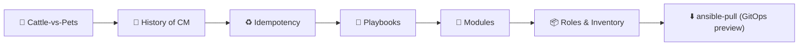
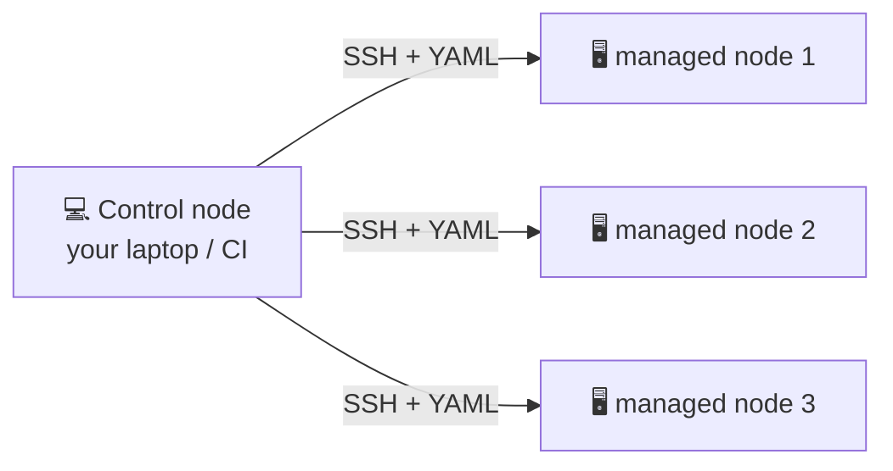
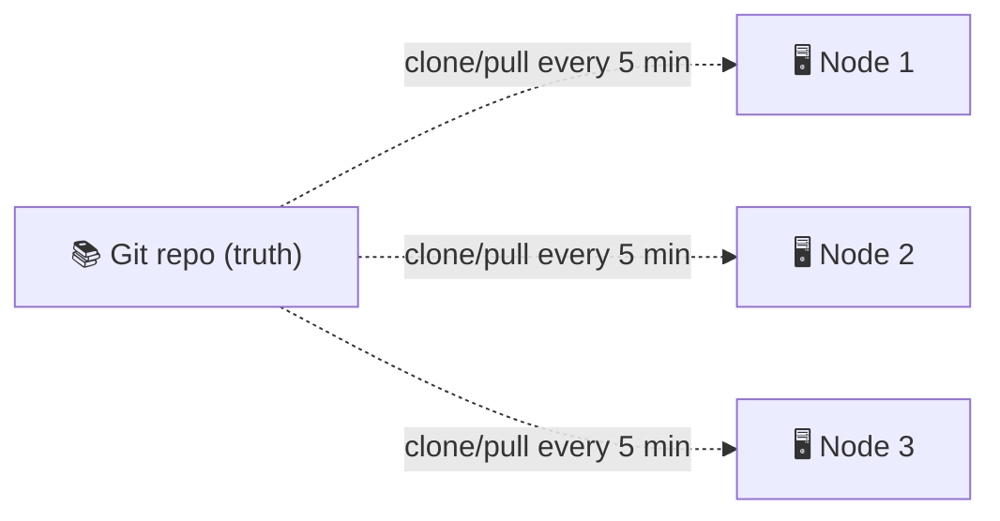
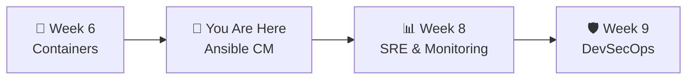

# 📌 Lecture 7 — Configuration Management with Ansible: Idempotent, Declarative, in Git

---

## 📍 Slide 1 – 💥 The Server Nobody Could Reproduce

* 🗓️ **A real-world startup, ~2014** — `web-03` has been serving production for two years. Nobody has SSH-d in for six months. It "just works"
* 💀 The disk fails. The team tries to rebuild from the runbook
* 🪦 The runbook is **3 pages** long. The actual installed software, by `dpkg --list`, has **412 packages** with no version tracking
* 🚪 **Three days of downtime** while engineers reverse-engineer what was on the box
* 🎓 **Lesson:** A server that can't be rebuilt from a text file is a **liability**, not an asset. Configuration Management is the discipline that fixes this

> 🤔 **Think:** If your laptop died right now, could you rebuild your QuickNotes VM from a text file in 5 minutes? Or would you spend an evening clicking?

---

## 📍 Slide 2 – 🎯 Learning Outcomes

| # | 🎓 Outcome |
|---|-----------|
| 1 | ✅ Explain what Configuration Management is and the cattle-vs-pets connection |
| 2 | ✅ Recognize the major tools: CFEngine, Puppet, Chef, Ansible, Salt |
| 3 | ✅ Define **idempotency** and why it's the magic property |
| 4 | ✅ Write a small Ansible **playbook** with tasks, handlers, and inventory |
| 5 | ✅ Use modules: `apt`, `copy`, `template`, `systemd`, `service` |
| 6 | ✅ Deploy QuickNotes to a Vagrant VM with a single `ansible-playbook` |

---

## 📍 Slide 3 – 🗺️ Lecture Overview



* 📍 Slides 1-5 — Why CM exists; the four big tools
* 📍 Slides 6-10 — Ansible's model, playbooks, idempotency
* 📍 Slides 11-15 — Modules, templates, handlers, roles
* 📍 Slides 16-19 — ansible-pull, antipatterns, Lab 7
* 📍 Slides 20-21 — Takeaways + resources

---

## 📍 Slide 4 – 📜 A Short History of Configuration Management

| Year | Tool | What it added |
|-----:|------|---------------|
| 1993 | **CFEngine** (Mark Burgess) | Promise theory; declarative; agent-based |
| 2005 | **Puppet** (Luke Kanies) | Ruby DSL; large enterprise adoption |
| 2009 | **Chef** (Adam Jacob) | Pure Ruby "recipes"; ordered execution |
| 2011 | **Salt** (Thomas Hatch) | Event-driven; ZeroMQ transport |
| 2012 | **Ansible** (Michael DeHaan) | Agentless via SSH; YAML; flat learning curve |
| 2015 | Ansible Galaxy | Shareable roles community |
| 2018 | Ansible acquired by Red Hat | Becomes corporate-supported |

* 🎯 **Ansible won the mindshare** in the 2015-2020 era for one reason: **no agent**. SSH is everywhere; YAML is readable
* 🤖 In 2026 Ansible still dominates the on-prem and VM space; Kubernetes ate the container-orchestration use case

---

## 📍 Slide 5 – ♻️ The Magic Word: Idempotency

> 💡 **Idempotent (n):** A property such that running an operation **once** produces the same end state as running it **a hundred times**.

| Operation | Idempotent? | Why it matters |
|-----------|:-----------:|----------------|
| `apt install -y nginx` | ✅ | Run twice → still installed |
| `echo "x" >> /etc/hosts` | ❌ | Run twice → two copies |
| Ansible `lineinfile` module | ✅ | Ensures *exactly* the line you want |
| Ansible `command` module | ❌ by default (you must add `creates:` / `changed_when:`) | Pure side effect |
| `kubectl apply -f deployment.yaml` | ✅ | The whole declarative model |

* 🛡️ Idempotency is what lets you **re-run** a playbook safely after a partial failure
* 🪤 Most config-mgmt tool modules are **idempotent by construction** — that's their value over shell scripts

---

## 📍 Slide 6 – 🔌 Ansible's Mental Model



| Term | What it is |
|------|-----------|
| **Control node** | Where Ansible runs (your laptop, a CI job). Needs Python + Ansible installed |
| **Managed node** | The target. Needs **only** Python (already on most Linuxes). No agent |
| **Inventory** | The list of managed nodes — INI, YAML, or dynamic (cloud-discovered) |
| **Playbook** | A YAML file describing the desired state |
| **Module** | A pre-built atomic action (install package, copy file, restart service) |
| **Role** | A reusable bundle of tasks/templates/vars |

* 🎯 No agent on the target → installing Ansible on a fleet is "install on your laptop once"

---

## 📍 Slide 7 – 📄 The Playbook, Sample

```yaml
# playbook.yaml
- name: Install and run QuickNotes
  hosts: quicknotes_vm
  become: true                # ✅ run with sudo
  vars:
    quicknotes_version: "0.1.0"
    listen_addr: ":8080"

  tasks:
    - name: Create system user
      user:
        name: quicknotes
        system: true
        shell: /usr/sbin/nologin

    - name: Copy binary
      copy:
        src: "files/quicknotes-{{ quicknotes_version }}"
        dest: /usr/local/bin/quicknotes
        owner: quicknotes
        mode: "0755"
      notify: restart quicknotes

    - name: Install systemd unit
      template:
        src: templates/quicknotes.service.j2
        dest: /etc/systemd/system/quicknotes.service
      notify: restart quicknotes

    - name: Enable + start service
      systemd:
        name: quicknotes
        enabled: true
        state: started
        daemon_reload: true

  handlers:
    - name: restart quicknotes
      systemd:
        name: quicknotes
        state: restarted
```

---

## 📍 Slide 8 – 📒 Inventory: Who Are We Targeting?

```ini
# inventory.ini
[quicknotes_vm]
qn-vm-1 ansible_host=127.0.0.1 ansible_port=2222 ansible_user=vagrant

[production]
qn-prod-1 ansible_host=10.0.1.10
qn-prod-2 ansible_host=10.0.1.11

[production:vars]
listen_addr=":80"
```

```yaml
# inventory.yaml (the modern style)
all:
  children:
    quicknotes_vm:
      hosts:
        qn-vm-1:
          ansible_host: 127.0.0.1
          ansible_port: 2222
          ansible_user: vagrant
```

* 🏷️ **Groups** let you target subsets: `hosts: production`, `hosts: quicknotes_vm`
* 🤖 **Dynamic inventory** queries AWS/GCP/Azure/Hetzner at runtime — no manual list to maintain

---

## 📍 Slide 9 – 🧰 The Five Modules You'll Use 80% of the Time

| Module | What it does | Idempotent |
|--------|--------------|:----------:|
| `apt` / `dnf` / `package` | Install/remove packages | ✅ |
| `copy` / `template` | Put files on the target | ✅ |
| `file` | Manage permissions, symlinks, directories | ✅ |
| `service` / `systemd` | Start/stop/enable services | ✅ |
| `user` / `group` | Manage users & groups | ✅ |

```yaml
# ✅ idempotent: ensures the file's owner + mode, only changes what's wrong
- name: Configure quicknotes data dir
  file:
    path: /var/lib/quicknotes
    state: directory
    owner: quicknotes
    group: quicknotes
    mode: "0750"
```

* 🪤 `shell:` and `command:` are escape hatches — use last; you lose idempotency

---

## 📍 Slide 10 – 🪞 Templates with Jinja2

```jinja
# templates/quicknotes.service.j2
[Unit]
Description=QuickNotes API
After=network-online.target

[Service]
ExecStart=/usr/local/bin/quicknotes
Restart=on-failure
User=quicknotes
Environment=ADDR={{ listen_addr }}
Environment=DATA_PATH=/var/lib/quicknotes/notes.json

[Install]
WantedBy=multi-user.target
```

* 🧠 Variables flow in from the playbook → group_vars → host_vars → CLI `-e key=value`
* 🪄 Same template, different values per environment (`listen_addr: :8080` in dev, `:80` in prod)
* ✅ The `template` module **regenerates** the file only if the rendered output differs — and triggers handlers if so

---

## 📍 Slide 11 – 🔔 Handlers: Run Only When Something Changed

```yaml
tasks:
  - name: Install nginx config
    template:
      src: nginx.conf.j2
      dest: /etc/nginx/nginx.conf
    notify: reload nginx       # ✅ notify only if file actually changed

handlers:
  - name: reload nginx
    service:
      name: nginx
      state: reloaded
```

* 🪤 If the config didn't change, the handler **does not fire** — no unnecessary reloads
* ⏳ Handlers run at the **end** of the play (or `meta: flush_handlers` to force earlier)
* 🛡️ This is the Ansible pattern for "config changed → restart only this service"

---

## 📍 Slide 12 – 📦 Roles: Reusable Building Blocks

```text
roles/quicknotes/
├── tasks/main.yaml         # the task list
├── handlers/main.yaml      # restart, reload
├── templates/
│   └── quicknotes.service.j2
├── files/
│   └── quicknotes-0.1.0    # static binary
├── defaults/main.yaml      # overridable variables
├── vars/main.yaml          # role-pinned variables
└── meta/main.yaml          # dependencies on other roles
```

```yaml
# playbook just composes roles
- hosts: quicknotes_vm
  roles:
    - common
    - quicknotes
```

* 🤝 **Ansible Galaxy** (galaxy.ansible.com) hosts community roles — great for ssh-hardening, nginx, postgres
* ⚠️ Like any third-party content, **review before you trust it**

---

## 📍 Slide 13 – 🔐 Secrets: Ansible Vault

```bash
# encrypt a vars file (interactive password)
ansible-vault create group_vars/production/vault.yaml
ansible-vault edit  group_vars/production/vault.yaml
ansible-vault view  group_vars/production/vault.yaml

# run a playbook using the password
ansible-playbook -i inventory.ini play.yaml --ask-vault-pass
```

* 🔒 AES-256 symmetric encryption; password stays out of Git
* 🤖 In CI, password lives in a CI secret and is passed via `--vault-password-file`
* 🛡️ Vault is good for "config-time" secrets; for "deploy-time cloud creds", prefer OIDC (Lecture 3)

---

## 📍 Slide 14 – ⬇️ ansible-pull: The GitOps Preview

Instead of pushing from a control node, **let the target pull from Git on a schedule**:

```bash
# on the managed node (or systemd timer)
ansible-pull \
  -U https://github.com/inno-devops-labs/quicknotes.git \
  -i hosts.ini \
  ansible/playbook.yaml
```



* 🌟 This is the **same pattern** as ArgoCD/Flux — Git is the truth, the agent pulls and converges
* 🎁 Lab 7 Bonus task wires this up via a systemd timer — your first GitOps experience

> 💬 *"Git → pull → reconcile."* — the spine of every modern deploy system, just at different abstraction levels

---

## 📍 Slide 15 – ❌ Ansible Antipatterns

| 🔥 Antipattern | ✅ Better |
|----------------|----------|
| Long playbooks (1000+ lines) | Roles + role dependencies |
| `shell:` everywhere instead of modules | Use `apt`, `file`, `systemd` modules first |
| Hard-coded paths in tasks | Variables in `defaults/main.yaml`, overridable |
| Plaintext secrets in `vars.yaml` | Ansible Vault |
| Running playbooks against unknown hosts | Inventory groups; `--limit` flag |
| `gather_facts: true` (default) when you don't need it | `gather_facts: false` saves 5-30 s on every run |
| One playbook for 100 unrelated tasks | Tag tasks (`tags: [config, restart]`) and run subsets |

---

## 📍 Slide 16 – 🏎️ Speed: Forks, Pipelining, Mitogen

```yaml
# ansible.cfg
[defaults]
forks = 20             # ✅ parallel hosts; default 5
host_key_checking = false   # OK for ephemeral CI hosts
gathering = smart      # ✅ cache facts where safe

[ssh_connection]
pipelining = true      # ✅ ~2x faster on slow links
control_path = ~/.ansible/cp/%%h-%%p-%%r
```

* ⚡ **Pipelining** sends fewer SSH round-trips per task — huge wins on high-latency links
* 🐍 [Mitogen for Ansible](https://mitogen.networkgenomics.com/) — drops the right Python connection model in; 1.25-7× speed-ups on real workloads
* 🧪 Lab 7 plays will finish in **under 30 seconds** on a single VM — measure before/after

---

## 📍 Slide 17 – 📜 Real Story: A Better Knight Capital

Recall Lecture 1's Knight Capital story — manual deploy missed one server out of eight, $440M loss.

How would proper config mgmt have prevented it?

* 🔁 `ansible-playbook -i prod-inventory deploy.yaml` — **all 8 hosts at once**, in a single `ansible-playbook` invocation
* ✅ Pre-deploy: `--check` (dry-run) confirms what *will* change
* 🪪 Post-deploy: a task verifies the binary checksum on each host
* 🚨 If even one host fails, the play aborts and reports
* ⏳ Total wall-clock time: **2 minutes**. Manual checklist time: ~45 (and one server missed)

> 🎓 **The lesson isn't "Ansible would have saved Knight."** It's that *making deploys atomic and verified* is what saves you — Ansible is one good tool that helps you do it.

---

## 📍 Slide 18 – 🧪 Lab 7 Preview: Deploy QuickNotes via Ansible

* 🔨 **Task 1 (6 pts):** Write `ansible/playbook.yaml` + a Jinja2 systemd unit + an inventory targeting your Lab 5 VirtualBox VM. Run `ansible-playbook` to deploy QuickNotes; `curl :8080/health` from the host
* ♻️ **Task 2 (4 pts):** Demonstrate idempotency — run the playbook twice; verify `changed=0` the second time. Then change one variable, re-run, verify only the affected handlers fire
* 🎁 **Bonus (2 pts):** Wire `ansible-pull` via a systemd timer on the VM so it auto-converges every 5 minutes from the course repo. Edit something in Git; watch the VM heal
* 📜 Deliverable: `submissions/lab7.md` with playbook output, idempotency proof, and reflection

---

## 📍 Slide 19 – 🧠 Key Takeaways

1. 🐄 **Config Management is what makes cattle-vs-pets executable** — your servers exist *because* of a text file
2. ♻️ **Idempotency is the property** — re-runs are safe; partial failures are recoverable
3. 🤝 **Ansible's win: agentless** — SSH + Python on the target is enough
4. 📦 **Roles for reuse, templates for variation, vault for secrets** — three patterns, used together
5. 🔁 **Handlers fire only on change** — no needless restarts
6. ⬇️ **ansible-pull = Git → target convergence loop** — the same pattern that powers ArgoCD, Flux, and every modern deploy system

---

## 📍 Slide 20 – 🚀 What's Next + 📚 Resources

* 📍 **Next lecture:** SRE & Monitoring — golden signals, Prometheus, dashboards
* 🧪 **Lab 7:** Deploy QuickNotes to your VirtualBox VM via Ansible; demonstrate idempotency; Bonus: ansible-pull GitOps
* 📖 **Read this week:**
  * 📕 *Ansible Up & Running* — Lorin Hochstein & René Moser (3rd ed) — Chapters 1-6
  * 📗 *Ansible for DevOps* — Jeff Geerling — free draft + paid full edition
  * 📘 [Ansible docs — User Guide](https://docs.ansible.com/ansible/latest/user_guide/index.html)
  * 📝 [The Cathedral and the Bazaar](http://www.catb.org/~esr/writings/cathedral-bazaar/) — Eric Raymond — for the broader OSS context behind tools like Ansible
* 🛠️ **Tools to install this week:** Ansible 10.x (Python 3.11+), `ansible-lint`, optionally Mitogen



> 🎯 **Remember:** The discipline is *"everything that runs on a server is described in a file in Git"* — Ansible is one good way to express that file. The discipline outlives the tool.
