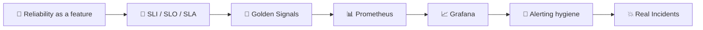
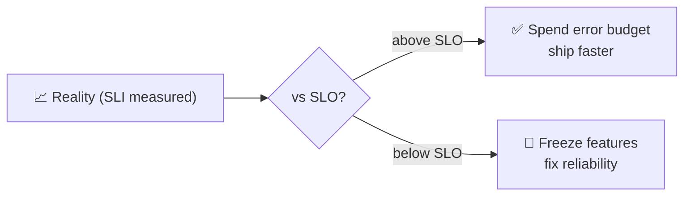
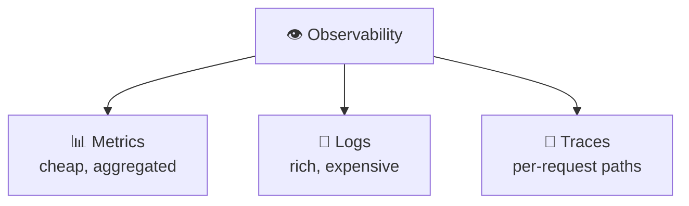
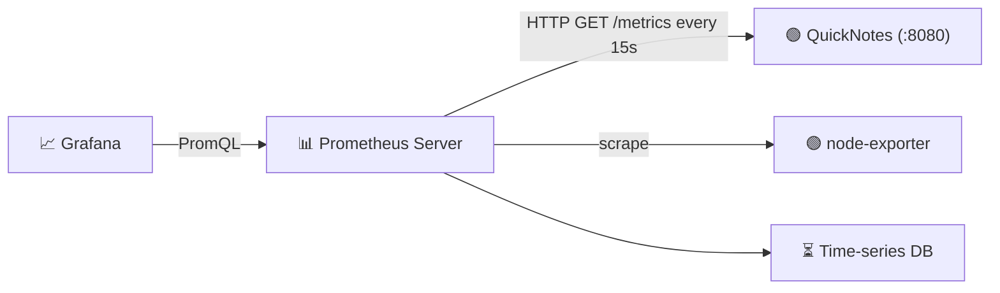
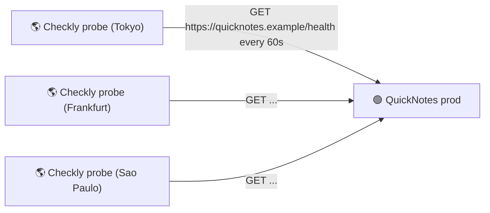
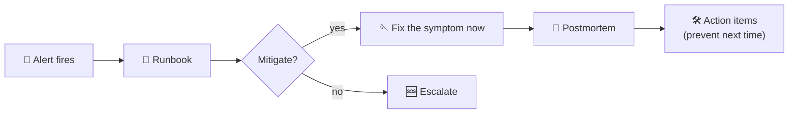
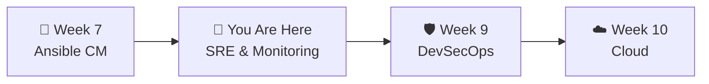

# 📌 Lecture 8 — SRE & Monitoring: Reliability Is an Engineering Discipline

---

## 📍 Slide 1 – 💥 The Outage You Didn't Know About

* 🗓️ **A typical Tuesday** — your QuickNotes deploy goes out at 14:03. CI is green. Lab 7 deploy succeeded. You go to lunch
* 🚨 At 14:11, error rate jumps from 0.1% to 4.2%. p95 latency triples. Saturation creeps up
* 🪦 **No alert fires.** No one looks at a dashboard. Customers slowly notice ("the app is slow today…")
* 🕓 By 16:30 — when someone finally sees a graph — you've degraded service for **2.5 hours**
* 🎓 **Lesson:** *Code* tells you what your service should do. *Monitoring* tells you what it actually did

> 🤔 **Think:** Lab 3 caught the bug at PR time. Lab 8 catches the bug *after the deploy*. Both matter. Today is the second one.

---

## 📍 Slide 2 – 🎯 Learning Outcomes

| # | 🎓 Outcome |
|---|-----------|
| 1 | ✅ Distinguish SRE from DevOps; explain reliability as a feature |
| 2 | ✅ Cite the **Four Golden Signals**: latency, traffic, errors, saturation |
| 3 | ✅ Define **SLI**, **SLO**, **SLA**, **error budget** |
| 4 | ✅ Compare metrics, logs, traces (the three pillars of observability) |
| 5 | ✅ Read PromQL, set up Prometheus + Grafana for QuickNotes |
| 6 | ✅ Write an alert that doesn't wake you at 3 a.m. for no reason |

---

## 📍 Slide 3 – 🗺️ Lecture Overview



* 📍 Slides 1-6 — Why SRE exists; SLOs and error budgets
* 📍 Slides 7-10 — Metrics, logs, traces; Prometheus model
* 📍 Slides 11-14 — Dashboards, alerts, on-call
* 📍 Slides 15-18 — Real incidents, lab preview, takeaways

---

## 📍 Slide 4 – 📜 Where SRE Came From

* 🏢 **2003** — Ben Treynor Sloss joins Google to run production engineering. His pitch: *"Hire software engineers to run operations"*
* 📚 **2016** — Google publishes *Site Reliability Engineering*, ed. Beyer, Jones, Petoff, Murphy — free at sre.google
* 🛠️ **2018** — *The Site Reliability Workbook* — applied examples, postmortem templates
* 🎓 In 2026, SRE is mainstream — almost every product company has SLOs, error budgets, and on-call rotations

> 💬 *"Hope is not a strategy."* — Google SRE motto

---

## 📍 Slide 5 – ⚖️ DevOps vs SRE: Cousins, Not Rivals

| | DevOps | SRE |
|---|--------|-----|
| Mantra | "You build it, you run it" | "Class SRE implements DevOps" |
| Focus | Speed + collaboration | Reliability + automation |
| Tooling | CI/CD, IaC, observability | SLOs, runbooks, postmortems |
| Where you find it | Most product teams | Larger orgs with explicit SRE function |
| Source | Patrick Debois 2009 movement | Google ~2003, popularized 2016 |

* 🤝 **DevOps is the broader culture.** SRE is one **prescriptive way** to implement parts of it
* 🎯 In a 10-engineer startup, the same person wears both hats. At 10,000 engineers, you have an SRE team

---

## 📍 Slide 6 – 🎯 SLI, SLO, SLA, Error Budget

| Term | What it is | Example for QuickNotes |
|------|-----------|------------------------|
| **SLI** (Indicator) | A measured number | "% of `GET /notes` returning 2xx in < 300ms" |
| **SLO** (Objective) | The internal target | "99.9% over a 28-day window" |
| **SLA** (Agreement) | The external promise (legal) | "99.5% or we refund 10%" — looser than SLO |
| **Error budget** | `1 - SLO` × time | 0.1% × 28d = ~40 min/month of failure |



* 🪪 **Error budget = freedom to take risks.** Used wisely, it lets you ship at speed
* 💸 SLA breach often costs money. SLO breach should cost feature freeze

---

## 📍 Slide 7 – 🌟 The Four Golden Signals

From the Google SRE book, Chapter 6 — for *every* user-facing service, measure these:

| # | Signal | What it tells you | QuickNotes example |
|---|--------|-------------------|--------------------|
| 1 | ⏱️ **Latency** | Time per request (separate success vs failure!) | p50 / p95 / p99 of `GET /notes` |
| 2 | 🚦 **Traffic** | Demand on the system | Requests per second |
| 3 | 🐛 **Errors** | Rate of failed requests | Rate of 5xx + 4xx (depends on intent) |
| 4 | 📈 **Saturation** | How "full" the service is | CPU %, memory %, queue depth |

* 🔎 Get these four, and you've **caught 80% of production problems**
* 🚦 The "RED" method (Tom Wilkie, Weaveworks): **R**ate, **E**rrors, **D**uration — same idea, shortened

---

## 📍 Slide 8 – 🔍 The Three Pillars of Observability



| Pillar | Best for | Tools |
|--------|----------|-------|
| 📊 **Metrics** | "How is the system *now*?" | Prometheus, OpenMetrics |
| 📜 **Logs** | "What happened to *this* request?" | journald, Loki, ELK |
| 🧵 **Traces** | "Where did time go across services?" | OpenTelemetry, Jaeger, Tempo |

* 🎯 **DevOps-Intro covers metrics deeply (this lecture)**. Logs were Lecture 4. Traces are SRE-Intro Lab 8

---

## 📍 Slide 9 – 📊 Prometheus: The Pull Model



* 🆕 Prometheus (CNCF, graduated 2018) **pulls** metrics from targets — opposite of push-based StatsD/graphite
* 🆔 Each target exposes `/metrics` in text format (your QuickNotes already does — see `handlers.go`)
* ⏳ Stored as **time series** — `metric_name{label1="v",label2="v"} value timestamp`
* 🆓 Open source, single binary, no clustering required for small setups

---

## 📍 Slide 10 – 📐 PromQL: The Three Queries You Need

```promql
# 1) Instant rate of requests over the last minute
rate(quicknotes_http_requests_total[1m])

# 2) p95 latency of /notes
histogram_quantile(0.95,
  sum by (le) (rate(quicknotes_http_request_duration_seconds_bucket{route="/notes"}[5m]))
)

# 3) Error ratio (5xx + 4xx) over 5 minutes
sum(rate(quicknotes_http_responses_by_code_total{code=~"5..|4.."}[5m]))
  /
sum(rate(quicknotes_http_requests_total[5m]))
```

* 🔧 **Operators:** `rate()`, `sum by()`, `histogram_quantile`, `<`/`>` for alert thresholds
* 🪤 `rate()` works on counters only; for gauges use `avg_over_time()` / `delta()`
* 📚 PromQL playground: [promlabs.com/promql-cheat-sheet/](https://promlabs.com/promql-cheat-sheet/)

---

## 📍 Slide 11 – 📈 Grafana: Picture Worth a Thousand Logs

* 📊 Open source dashboarding (since 2014), data-source-agnostic (Prometheus, InfluxDB, Loki, …)
* 🪟 A dashboard is a JSON file → can be **provisioned**, **diff-ed**, **code-reviewed**
* 🎁 The Lab 8 plumbing ships a `grafana/provisioning/dashboards/golden-signals.json` — you fill in the panels
* 🚨 Grafana also does **alerting** (since v8, 2021) — many teams use it as one-stop monitoring + alerting

| Panel type | Best for |
|------------|----------|
| Time series | The default — rates, latencies, saturation over time |
| Stat | Big-number current value ("requests/sec right now") |
| Gauge | Bounded percentages ("CPU %") |
| Table | Top-N (slowest endpoints, biggest tenants) |

---

## 📍 Slide 12 – 🚨 Alerting Hygiene

> 🪤 **The most common reliability problem isn't *too few* alerts. It's *too many*.**

| 🔥 Bad alert | ✅ Good alert |
|--------------|--------------|
| Fires on a single error | Fires after sustained breach (≥ 5 min) |
| `CPU > 80%` | Latency exceeds SLO for 5 of last 10 minutes |
| 30 alerts per outage (cascade) | 1 actionable alert at the root cause |
| No link to a runbook | Links to a step-by-step `docs/runbook/X.md` |
| Wakes someone at 3 a.m. for a non-urgent issue | Pages only for **user-impacting**, can't-wait-till-morning issues |

* 🎯 **Symptom-based, not cause-based.** Alert on "users are seeing errors", not "disk is 91% full"
* 🛌 **Alert fatigue is real** — once on-call ignores half the pages, you're worse off than having no alerts

---

## 📍 Slide 13 – 🌐 Synthetic Monitoring & Checkly



* 🌍 **Synthetic monitoring** = a robot hits your site every minute from multiple regions
* 🛰️ Real users come from everywhere; metrics inside the cluster don't see what they see
* 🛠️ Tools: [Checkly](https://checklyhq.com), Pingdom, AWS Route 53 health checks, Better Stack
* 🎁 Lab 8 Bonus task wires Checkly free-tier against your deployed QuickNotes

---

## 📍 Slide 14 – 🩺 The On-Call Mindset



* 🎯 **First mitigate, then fix.** A 5-minute hack that stops the bleeding beats a 5-hour root-cause fix
* 📝 **Every page → a postmortem** (Lecture 1 covered the blameless format). The action items are the real value
* 🤝 **Healthy rotations:** ≤ 1 page per shift average, week-on/week-off, follow-the-sun across timezones

---

## 📍 Slide 15 – 📜 Real Story: The Slack 2022 Outage

* 🗓️ **February 22, 2022 (yes, "2/22/22")** — Slack offline for ~5 hours
* 🤖 Triggered by an automated config push that broke a database. Cascading failures took out web, messaging, file uploads
* 🩺 The status page itself struggled — hosted on the same infrastructure
* 📝 [Slack's public postmortem](https://slack.engineering/slacks-incident-on-2-22-22/) — text-book example: blameless, specific, action-items dated
* 🎓 **Lesson:** Sub-systems you treat as "magically reliable" (config push, status page, auth) deserve the same SLOs as the front door

---

## 📍 Slide 16 – ❌ Monitoring Antipatterns

| 🔥 Antipattern | ✅ Better |
|----------------|----------|
| 50 dashboards, none updated since 2023 | One "Golden Signals" dashboard, kept honest |
| Alerts on every individual host | Alerts on the service-level SLI |
| `2xx` ratio close to 100% but no latency tracking | Latency p95 + error rate together |
| Logging full request bodies (PII risk + cost) | Sample; redact; structure (JSON) |
| `print()` debugging in production | Structured logs at appropriate levels |
| `CPU > 80%` page that fires for backups | Alert on user-facing symptoms |

---

## 📍 Slide 17 – 🧪 Lab 8 Preview: Observability for QuickNotes

* 📊 **Task 1 (6 pts):** Run Prometheus + Grafana via Compose against your QuickNotes container. Provision a "Golden Signals" dashboard (rate, error %, p95 latency, memory)
* 🚨 **Task 2 (4 pts):** Write *one* good alert: `error rate > 5% for 5 minutes`. Trigger it deliberately by setting `FAIL_RATE=1.0`. Verify the alert fires, document the runbook step
* 🌍 **Bonus (2 pts):** Spin up a Checkly free-tier synthetic check against your QuickNotes (deployed via Lab 7 or running locally with ngrok). Compare external view vs internal metrics
* 📜 Deliverable: `submissions/lab8.md` — dashboard screenshots, alert evidence, written analysis

---

## 📍 Slide 18 – 🧠 Key Takeaways

1. 📐 **Reliability is a feature** — budget for it, like any other feature
2. 🌟 **The Four Golden Signals** (Latency, Traffic, Errors, Saturation) catch 80% of incidents
3. 🎯 **SLI → SLO → error budget** is the framework that makes "reliable enough" measurable
4. 📊 **Metrics + Logs + Traces** are complementary, not redundant
5. 🚨 **Fewer, sharper alerts beat many noisy ones** — alert on user-visible symptoms
6. 📝 **Every page → a runbook → a postmortem** — closing the loop is how systems get better

---

## 📍 Slide 19 – 🚀 What's Next + 📚 Resources

* 📍 **Next lecture:** DevSecOps — shift security left; scan deps and images
* 🧪 **Lab 8:** Prometheus + Grafana for QuickNotes, one good alert, Bonus: Checkly synthetic
* 📖 **Read this week:**
  * 📕 *Site Reliability Engineering* — Beyer, Jones, Petoff, Murphy — **Chapters 3, 4, 6, 10** ([free](https://sre.google/sre-book/table-of-contents/))
  * 📗 *The Site Reliability Workbook* — Chapters 1-3 ([free](https://sre.google/workbook/table-of-contents/))
  * 📘 [Tom Wilkie — *The RED Method*](https://thenewstack.io/monitoring-microservices-red-method/) — quick read on golden signals
  * 📝 [Slack 2/22/22 postmortem](https://slack.engineering/slacks-incident-on-2-22-22/)
* 🛠️ **Tools this week:** Prometheus v3.x, Grafana 13.x, optionally Checkly free-tier



> 🎯 **Remember:** A service without monitoring is a service running in the dark. With the Four Golden Signals dashboard up, every incident response starts with **"what does the data say?"** — not **"who knows the most about this code?"**
